# COLMAP kernel tools

Four offline scripts in `tools/` (numpy only; matplotlib for the figure) that build a geometric kernel from a COLMAP reconstruction (or from COLMAP's matches plus a synthetic sequence's ground truth), run the culler on it, and compare it with the appearance kernel. The kernel is the pairwise shared information of the images' bundle-adjustment problem; placecell loads it like any host matrix, through [`set_kernel`](placecell.md#set_kernel), so nothing in the library depends on COLMAP.

```mermaid
---
config:
  htmlLabels: false
  themeCSS: "
    text, tspan { font-family: var(--md-text-font-family), sans-serif; }
    .edgePath .path, .flowchart-link { stroke: var(--md-mermaid-edge-color); }
    .marker, marker path { fill: var(--md-mermaid-edge-color); stroke: var(--md-mermaid-edge-color); }
    .edgeLabel rect, .labelBkg { fill: var(--md-default-bg-color); opacity: 1; }
    .edgeLabel text, .edgeLabel tspan { fill: var(--md-default-fg-color); }"
  themeVariables:
    fontSize: 19px
  flowchart:
    htmlLabels: false
    wrappingWidth: 320
    nodeSpacing: 25
    rankSpacing: 30
    curve: basis
    padding: 14
---
flowchart LR
    DB[("`**colmap_database.db**
    verified matches`")] --> GTM("`**colmap_gt_model.py**
    ground-truth poses · depths`")
    GTM -. "or" .-> MODEL
    MODEL[("`**COLMAP model**
    cameras · images · points3D`")] --> CIK("`**colmap_information_kernel.py**
    pairwise shared information`")
    RGB[("`**rgb.csv**
    the sequence's frames`")] --> CIK
    CIK --> OUT[("`kernel.npy · ids.csv
    mutual_information.npy`")]
    OUT --> KD("`**kernel_demo**
    set_kernel · cull`")
    KD --> SEL[("`**selection/rgb.csv**
    surviving frames`")]
    OUT --> CMP("`**compare_kernels.py**
    heatmaps · scatter · correlation`")
    D[("`**D.npy**
    VPR distances`")] --> CMP

    click GTM "#colmap_gt_modelpy"
    click CIK "#colmap_information_kernelpy"
    click KD "#colmap_kernel_demopy"
    click CMP "#compare_kernelspy"

    %% VSLAM-LAB logo squares: cyan #b5f3f9, periwinkle #8195fb, lavender #a59ddf
    classDef step fill:#b5f3f9,stroke:#7fcfd8,stroke-width:2px,color:#1b2a4a
    classDef store fill:#fff,stroke:#a59ddf,stroke-width:2px,color:#1b2a4a

    class GTM,CIK,KD,CMP step
    class DB,MODEL,RGB,OUT,SEL,D store
    linkStyle default stroke-width:2px
```



```bash
pixi run colmap-gt-model <database.db> --sequence <sequence>                 # a ground-truth model (synthetic sequences)
pixi run colmap-kernel <model_dir> --rgb-csv <sequence>/rgb.csv            # the kernel alone
pixi run colmap-demo <model_dir> --rgb-csv <sequence>/rgb.csv [--tau 0.9]   # kernel -> cull -> surviving rgb.csv, checked
pixi run compare-kernels <D.npy> <colmap_kernel_dir> [--centred]            # VPR vs COLMAP
```

## The model

For a pair of registered images $(i, j)$, take the variables of their joint bundle-adjustment problem: both poses and every 3D point either image sees. Each image's observations give a Gauss-Newton information matrix $H_i = J_i^\top J_i / \sigma_{\text{pix}}^2$ from the pinhole reprojection Jacobians, and an isotropic prior $L_0$ ($\sigma_t$, $\sigma_{\text{rot}}$ on the poses, $\sigma_{\text{point}}$ on the points) fixes the 7-DoF monocular gauge. Under the Laplace approximation the mutual information of the two images' measurements, and the kernel entry, are

$$
\begin{aligned}
I_{ij} &= \tfrac12\big[\log\det(L_0{+}H_i) + \log\det(L_0{+}H_j) - \log\det L_0 - \log\det(L_0{+}H_i{+}H_j)\big],\\
K_{ij} &= \frac{I_{ij}}{\sqrt{G_i\, G_j}}, \qquad G_i = I_{ii}
\end{aligned}
$$

$G_i$ is image $i$'s own information gain, so $K_{ij}$ is the fraction of each image's gain the pair shares, the normalised mutual information. Data processing gives $I_{ij} \le \min(G_i, G_j)$, so $K \in [0, 1]$ with unit diagonal; PSD is not guaranteed. Every log-determinant is a Schur complement of the independent 3×3 point blocks onto the pose block: a pair only needs its shared points, once each image's own reduction is known.

!!! warning "Tau lives on another scale"
    An image's unique information on this kernel is typically 0.54–0.90, since most of its gain is points and pose no other image shares, so tau ≈ 0.3 culls nothing. The useful range is about 0.7–0.95 (on a 53-image model, tau 0.9 kept 16 images centred, 19 raw; measured on 2026-09-07 with the original per-pair code, before the prior-term bug below existed); see [`2026-09-25_kernels.md`](../notes/2026-09-25_kernels.md).

## `colmap_information_kernel.py`

The kernel builder (`pixi run colmap-kernel`). Only registered images get a row. Row ids are the data-row index of the sequence's `rgb.csv`, matched by image file name, the same numbering as VPR-LAB's `D.npy`, so the two kernels line up.

### `main` {#kernel-main data-toc-label="main"}

```text
colmap_information_kernel.py <model_dir> [--rgb-csv rgb.csv] [--out dir]
    [--sigma-pix 1.0] [--prior-scale 1.0] [--sigma-t S] [--sigma-rot S] [--sigma-point S]
    [--check N] [--chunk 200000] [--quiet]
```

Reads the model with [`read_model`](#read_model), maps every registered image to its `rgb.csv` row with [`rgb_csv_rows`](#rgb_csv_rows), sets the priors, builds one [`ImageInfo`](#imageinfo) per image, computes every pair with [`pairwise_mutual_information`](#pairwise_mutual_information), normalises to $K$ and writes `kernel.npy` (float32), `mutual_information.npy` ($I_{ij}$ in nats, $G_i$ on the diagonal) and `ids.csv` (internal id, external id, COLMAP image id, name, information gain, observations) to `--out`, by default `<model_dir>/information_kernel`. On stdout: the gains, the pair count, the quantiles of $K$, its extreme eigenvalues and the median consecutive-frame entry.

The priors default to the model's own scale: $\sigma_t$ the median baseline between consecutive frames (in `rgb.csv` order), $\sigma_{\text{rot}}$ 1 rad, $\sigma_{\text{point}}$ the median distance of the points to their centroid, all multiplied by `--prior-scale`; $\sigma_{\text{pix}}$ is 1 pixel. `--check N` verifies N random overlapping pairs three ways, the batched value against the single-pair reduction ([`pair_logdet`](#pair_logdet)) against the dense system ([`dense_pair_logdet`](#pair_logdet)), and fails above a relative error of $10^{-6}$.

!!! warning "Pass the best sub-model"
    COLMAP may split a scene into sub-models `0`, `1`, …, and `best_model` names the one to use; on one ETH run `0` was a 2-image fragment. The script warns when the folder looks like a COLMAP output root with sub-models.

!!! warning "Ids and camera models"
    Without `--rgb-csv` it falls back to `rgb_exp.csv` next to the model, whose numbering is the experiment's input list rather than the sequence's (warned), then to COLMAP image ids. An image missing from the csv, or two images mapping to the same row, is an error (exit code 1). Non-pinhole cameras are approximated by their focal length and principal point, with their distortion ignored (warned).

!!! info "Cost"
    **Time and memory dominated by the pairs** (see [`pairwise_mutual_information`](#pairwise_mutual_information)): a 1180-image model with 38 M pair-point incidences takes about a minute and ~1.5 GB. `--check` is slow, ~6 min for 200 pairs.

### `read_model` {#read_model data-toc-label="read_model"}

```python
def read_model(model_dir: Path)
```

Reads a COLMAP model without pycolmap, preferring the binary files: `_read_bin` for `cameras.bin` / `images.bin` / `points3D.bin`, `_read_txt` for the text ones. Returns `cameras` (id → model name and parameters), `images` (id → rotation `R` from the quaternion by `qvec_to_rotation`, translation `t`, camera id, name, the keypoints `xy` and their 3D point ids `pid`, −1 for an unmatched keypoint) and `points` (id → xyz). `pinhole_params` extracts $f_x, f_y, c_x, c_y$ for any camera model. Raises `FileNotFoundError` when the folder has neither `images.bin` nor `images.txt`.

!!! info "Cost"
    **Time and space O(observations + points)**

### `ImageInfo` {#imageinfo data-toc-label="ImageInfo"}

```python
class ImageInfo:
    def __init__(self, image, fx, fy, cx, cy, points, lambda_p, prior_c, inv_sigma_pix, keep_jacobians=False)
```

One image's reduction, computed once so a pair only has to handle its shared points. For every observation it forms the pinhole Jacobians with respect to the pose (a left perturbation $[\delta\theta, \delta t]$ of cam-from-world) and the point, then aggregates them per unique 3D point: the point block $P_k = \lambda_p I + J_p^\top J_p$, its log-determinant, the coupling $B_k = J_x^\top J_p$, and the image's reduced pose information $A = L_0^{\text{pose}} + \sum_k (J_x^\top J_x - B_k P_k^{-1} B_k^\top)$. `gain` is $G_i$, and `rows(shared)` the rows of given point ids. With `keep_jacobians` it keeps the per-observation Jacobians for the dense check.

!!! note "Duplicate observations"
    COLMAP occasionally maps two keypoints of one image to the same 3D point. The Jacobians are formed per observation and the blocks aggregated per unique point; without that, pairs come out 40–100 nats wrong while single images look fine.

!!! info "Cost"
    **Time O(observations), space ~300 B per point**

### `pairwise_mutual_information` {#pairwise_mutual_information data-toc-label="pairwise_mutual_information"}

```python
def pairwise_mutual_information(infos: list, lambda_p: float, chunk_incidences: int = 200_000,
                                progress=None) -> tuple[np.ndarray, int]
```

$I_{ij}$ for every pair of images that share a point, batched over all pairs at once. With the single-image reductions in hand, a pair needs only its shared points:

$$
I_{ab} = \tfrac12\Big[\log\det A_a + \log\det A_b - \log\det S_{ab} - \sum_{k \in a \cap b}\big(\log\det P_k^{ab} - \log\det P_k^{a} - \log\det P_k^{b} + 3\log\lambda_p\big)\Big]
$$

where $S_{ab}$ (12×12) puts the shared points' single-image Schur terms back into $\operatorname{blockdiag}(A_a, A_b)$ and removes the joint ones, $P_k^{ab} = \lambda_p I + J_p^{a\top} J_p^a + J_p^{b\top} J_p^b$. Every image-point incidence gets a row in stacked arrays; incidences are sorted by point, the image pairs of every track enumerated with triangular indices (vectorised per track length), sorted by pair, and processed in chunks of at most `chunk_incidences` rows with batched einsums and segment sums. Returns the matrix $I$, with $G_i$ on the diagonal and 0 for pairs that share nothing, and the number of overlapping pairs; `progress(done, total)` is called after each chunk.

!!! warning "Fixed on 2026-09-30: the sign of the prior term"
    From 2026-09-10 (`7d39dc4`, when this batched version replaced the original per-pair loop) until the fix, the code (and this formula) had $-3\log\lambda_p$ per shared point, so every $I_{ij}$ was off by $3\,|a \cap b|\log\lambda_p$ nats, zero only when $\sigma_{\text{point}} = 1$. The ground-truth REPLICA model ($\sigma_{\text{point}} = 1.78$ m) exposed it, and the dense formula sided with the single-pair reduction. On ETH `table_3` the fix moves $K$ by up to 0.12 (mean 0.013), the consecutive-frame median from 0.39 to 0.50, and removes the 16 negative entries; kernels built between 2026-09-10 and the fix should be rebuilt.

!!! info "Cost"
    **Time O(Σ over tracks of L(L−1)/2), space ~30 B per pair-point incidence plus ~200 B per incidence of the current chunk**

### `pair_logdet`, `dense_pair_logdet` {#pair_logdet data-toc-label="pair_logdet, dense_pair_logdet"}

```python
def pair_logdet(a: ImageInfo, b: ImageInfo, shared: np.ndarray) -> float
def dense_pair_logdet(a: ImageInfo, b: ImageInfo, shared: np.ndarray) -> float
```

Two references for $\log\det(L_0 + H_a + H_b) - \log\det L_0$ of one pair, used only by `--check`. `pair_logdet` is the single-pair form of the Schur reduction the batched function uses; `dense_pair_logdet` builds and factorises the full $(12 + 3m)$-dimensional system, one column block per unique point and one residual per observation, and needs `ImageInfo(..., keep_jacobians=True)`. `logdet` and `batched_logdet` wrap `slogdet`, returning $-\infty$ for a non-positive determinant.

!!! info "Cost"
    **`pair_logdet` O(m), `dense_pair_logdet` O((12 + 3m)³)** for m shared points, hence the slow check.

### `rgb_csv_rows` {#rgb_csv_rows data-toc-label="rgb_csv_rows"}

```python
def rgb_csv_rows(path: Path) -> dict[str, int]
```

Maps the file name of every frame in a sequence's `rgb.csv` (the `path_rgb_0` column, or the second column without a header of that name) to its 0-based data-row index: the id each registered image gets.

!!! info "Cost"
    **Time and space O(frames)**

## `colmap_kernel_demo.py`

The chained offline selection (`pixi run colmap-demo`), the counterpart of `kernel_demo <D.npy>` for the geometric kernel.

### `main` {#demo-main data-toc-label="main"}

```text
colmap_kernel_demo.py <model_dir> --rgb-csv <sequence>/rgb.csv [--tau 0.9]
    [--min-keyframes 5] [--raw] [--clip] [--out dir] [--kernel-demo path] [--verbosity L] [--skip-kernel]
```

Runs [`colmap_information_kernel.py`](#kernel-main) (unless `--skip-kernel` and a kernel exists), then `kernel_demo <out>/kernel.npy --kind similarity --ids <out>/ids.csv` with the culler at `--tau` (0.9 by default, on this kernel's scale), writing the dump and the survivors' `rgb.csv` to `<out>/selection_tau<T>[_raw]`. It then checks the result: the surviving csv has the source's header, as many rows as alive views and as `kernel_demo` reported, each row equal to its source row and naming its registered image; alive plus culled views are exactly the registered images; and the first registered frame survived (`kernel_demo` protects it). Prints the kept and culled ids and exits 1 when a step or a check fails. `run` executes one step, echoing its output and exiting on failure.

!!! note "A stale pointer in the docstring"
    The script's docstring points at `CLAUDE.md` for the tau sweep; the numbers are in [`2026-09-25_kernels.md`](../notes/2026-09-25_kernels.md).

!!! info "Cost"
    **The kernel's cost, plus one `kernel_demo` cull** (O(n³) for the inverse and the PSD check, n registered images).

## `colmap_gt_model.py`

A COLMAP text model built from a COLMAP database's verified matches and the ground truth of a synthetic VSLAM-LAB sequence (`pixi run colmap-gt-model`), in place of COLMAP's own reconstruction: the kernel is then computed on the true poses and points instead of COLMAP's estimate of them, over every image the matcher saw. It needs an RGB-D sequence with ground-truth poses, such as REPLICA.

### `main` {#gt-main data-toc-label="main"}

```text
colmap_gt_model.py <colmap_database.db> --sequence <VSLAM-LAB-Benchmark/<DATASET>/<sequence>>
    [--out dir] [--max-reproj 2.0] [--max-depth-rel 0.02] [--pixel-offset auto|0|0.5]
```

Reads the database's images, keypoints, camera and verified inlier matches (`read_database`; COLMAP's WATERMARK pairs are excluded), the sequence's `rgb.csv`, `groundtruth.csv` and `calibration.yaml` (`read_sequence`, `read_calibration`), and one depth image per database image, matched by file name. Every keypoint is back-projected with its ground-truth z-depth (the PNG value over `depth_factor`, at the nearest pixel) and its image's pose, `groundtruth.csv` being world-from-camera (TUM) and converted to COLMAP's camera-from-world.

Then, in order:

1. **Conventions.** On 200,000 sampled matches, the median transfer error (a keypoint's back-projection reprojected into the matching image) is measured for each `--pixel-offset` candidate; `auto` keeps the better of 0 and 0.5. Above `--max-reproj` the pose convention or the depth type is wrong, and nothing is written.
2. **Matches.** A verified match is kept only when the ground truth confirms it: every side with a depth transfers into the other within `--max-reproj`. This has to happen before the tracks are joined: a few false matches otherwise chain unrelated tracks into giant ones, and their median point fits none of them.
3. **Tracks and points.** `connected_components` joins the confirmed matches into tracks; a track's point is the median of its depth-backed back-projections (`group_median`). An observation is dropped when it reprojects more than `--max-reproj` px from the point, or its depth disagrees by more than `--max-depth-rel` (two passes); of two keypoints of one image in a track the one closer to the point is kept; a track needs two surviving observations in different images.
4. **Output.** `cameras.txt` (the database's camera), `images.txt` (the ground-truth poses and every keypoint, −1 for those not in a track) and `points3D.txt` in `--out`, by default `<database_dir>/gt_model`, ready for [`colmap_information_kernel.py`](#kernel-main).

It prints the transfer error for each offset, the confirmed matches, the tracks, what each filter removed, the reprojection error of the kept observations and the track lengths. On REPLICA `office0` (400 images, 7.7 M verified matches): offset 0 fits at 0.33 px against 0.45 px for 0.5, 89.5 % of the matches are confirmed, and 22,060 points remain with a median reprojection error of 0.23 px (p95 1.25 px) and a median track length of 5.

```bash
pixi run colmap-gt-model <eval>/REPLICA/office0/colmap_00000/colmap_database.db \
    --sequence <benchmark>/REPLICA/office0 --out <eval>/REPLICA/office0/gt_model
pixi run colmap-kernel <eval>/REPLICA/office0/gt_model --rgb-csv <benchmark>/REPLICA/office0/rgb.csv \
    --out <eval>/REPLICA/office0/gt_kernel
```

!!! note "The pixel convention"
    COLMAP places pixel centres at +0.5, so an offset of 0.5 would be expected against a calibration with integer centres; on REPLICA an offset of 0 fits better, hence `auto`.

!!! warning "The kernel tool's dense check"
    `colmap_information_kernel.py --check` does not finish in reasonable time on this model: the dense system of a pair covers every point of both images, thousands of dimensions with these long tracks. Check a few pairs against `pair_logdet` instead.

!!! info "Cost"
    **Time O(matches + keypoints), about 10 s on REPLICA `office0`; memory ~3.3 GB** there, dominated by the 7.7 M match arrays.

## `compare_kernels.py`

The appearance kernel against the geometric one over the same images (`pixi run compare-kernels`).

### `main` {#compare-main data-toc-label="main"}

```text
compare_kernels.py <D.npy> <colmap_kernel_dir> [--kind squared-euclidean] [--out fig.png]
                   [--centred] [--no-normalise] [--show]
```

Loads the COLMAP kernel and its ids with `load_ids`, and restricts the VPR matrix to the same `rgb.csv` rows (both are indexed by them), converted with `similarity_from_distance` and symmetrised, since the rotation-min matrix is not symmetric. Both are ordered by frame id, optionally double-centred (`--centred`, what the culler marginalises), and min-max normalised to $[0, 1]$ over their off-diagonal entries unless `--no-normalise`, since the VPR cosine has a ~0.37 floor and the information kernel lives in 0–0.6. Prints both ranges, the Pearson and Spearman correlations of the paired off-diagonal entries, the mean and largest difference and the five most disagreeing pairs; saves a figure with both heatmaps, their difference and a scatter of the paired entries to `--out`, by default `<colmap_kernel_dir>/compare_kernels[_centred].png`.

`similarity_from_distance` accepts the same kinds as placecell's `kernel_io` (`similarity`, `squared-euclidean`, `cosine-distance`, `euclidean`, plus the aliases `faiss` and `cosine`); `centre` is the formula of [`PlaceCell::centre_kernel`](placecell.md#centre_kernel) over every row, with no usable-row filter; `normalise` is the min-max scaling with the diagonal kept at 1.

!!! info "Cost"
    **Time O(n²), plus O(n²) for the figure; space O(N² + n²)**, with N the rows of `D.npy` and n the registered images.
