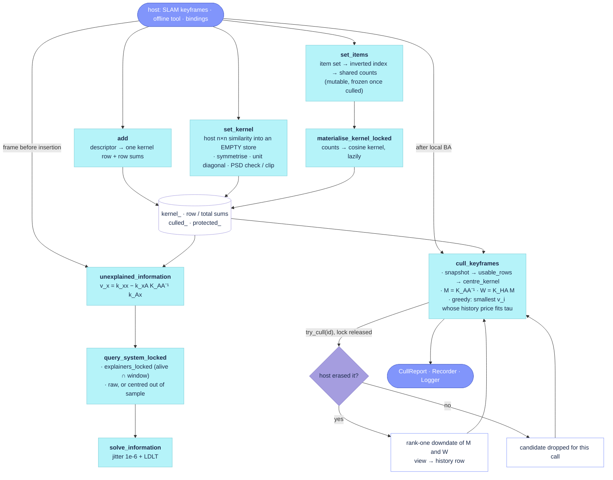

# `src/placecell.cpp`

The store and the maths. `PlaceCell` is an id-mapped, append-only store of views (the host's
keyframes) plus the similarity kernel over them, filled in one of three ways that never mix
(descriptors through `add`, a host matrix through `set_kernel`, item sets through `set_items`),
and two consumers of that kernel: `unexplained_information`, the read-only insertion query, and
`cull_keyframes`, the greedy joint-information culler that hands each cull back to the host
through a callback. It runs on whichever host thread calls it: a single `mutex_` guards the
store, every method takes its snapshot under the lock and does the linear algebra outside it, and
the cull callback is invoked with the lock released. The event hooks (`on_add`, `on_query`, …)
that feed the Recorder and the Logger live in `src/placecell_events.cpp`. The sources carry no
`// #` section banners, so this page groups the functions by call-graph order.

Sources: `src/placecell.cpp`, `src/placecell_events.cpp`, `src/placecell_cull.cpp`, `include/placecell/placecell.h`;
the gram-greedy method has its own page, [`placecell_gram_greedy.md`](placecell_gram_greedy.md).
Reading notes: [`docs/review/placecell.md`](../review/placecell.md). The contracts (idempotence,
pointer stability, NaN semantics, thread-safety) are in the header comment and are not repeated
here; the culler's derivation is in the comment block at the top of its body.

## State

| Member | Holds | Written by | Mode |
|---|---|---|---|
| `kernel_` | the n×n float similarity; NaN marks an unusable view | `add` (one row), `set_kernel` (whole), `materialise_kernel_locked` (rebuilt) | all |
| `kernel_row_sums_`, `kernel_total_sum_` | row sums and total of `kernel_`, for out-of-sample centring; NaN row sum = empty item set | `add` (one row), `set_kernel` (whole), `materialise_kernel_locked` (rebuilt) | all |
| `item_mode_` | the store was filled by `set_items` | `set_items` | item |
| `item_norms_` | internal id → \|P_i\| | `set_items` | item |
| `item_counts_` | n×n integer shared-item counts, diagonal \|P_i\| | `set_items` | item |
| `kernel_dirty_` | `item_counts_` changed since `kernel_` was last rebuilt | `set_items` sets, `materialise_kernel_locked` clears | item |

## Call graph

- **Filling the store** — [`add`](https://github.com/alejandrofontan/placecell/blob/main/src/placecell.cpp#L81) → [`on_add`](https://github.com/alejandrofontan/placecell/blob/main/src/placecell_events.cpp#L33); [`set_kernel`](https://github.com/alejandrofontan/placecell/blob/main/src/placecell.cpp#L171 "PlaceCell::set_kernel(const Eigen::MatrixXf& similarity, const std::vector<ExternalId>& ids,") → [`on_set_kernel`](https://github.com/alejandrofontan/placecell/blob/main/src/placecell_events.cpp#L51); [`set_items`](https://github.com/alejandrofontan/placecell/blob/main/src/placecell.cpp#L618 "PlaceCell::set_items(const ExternalId id, std::vector<ItemId> items, const ItemOptions") → [`on_set_items`](https://github.com/alejandrofontan/placecell/blob/main/src/placecell_events.cpp#L41); every kernel reader → [`materialise_kernel_locked`](https://github.com/alejandrofontan/placecell/blob/main/src/placecell.cpp#L735) (item mode only); [`clear`](https://github.com/alejandrofontan/placecell/blob/main/src/placecell.cpp#L363)
- **Insertion query** — [`unexplained_information`](https://github.com/alejandrofontan/placecell/blob/main/src/placecell.cpp#L421) (descriptor) and [`unexplained_information`](https://github.com/alejandrofontan/placecell/blob/main/src/placecell.cpp#L775 "PlaceCell::unexplained_information(const std::vector<ItemId>& items,") (items) → [`compute_unexplained_information`](https://github.com/alejandrofontan/placecell/blob/main/src/placecell.cpp#L435) / [`compute_unexplained_information`](https://github.com/alejandrofontan/placecell/blob/main/src/placecell.cpp#L789 "PlaceCell::compute_unexplained_information(const std::vector<ItemId>& items,") → [`explainers_locked`](https://github.com/alejandrofontan/placecell/blob/main/src/placecell.cpp#L498), [`query_system_locked`](https://github.com/alejandrofontan/placecell/blob/main/src/placecell.cpp#L524), [`solve_information`](https://github.com/alejandrofontan/placecell/blob/main/src/placecell.cpp#L588); then [`on_query`](https://github.com/alejandrofontan/placecell/blob/main/src/placecell_events.cpp#L75)
- **Culling** — [`cull_keyframes`](https://github.com/alejandrofontan/placecell/blob/main/src/placecell.cpp#L854) → [`materialise_kernel_locked`](https://github.com/alejandrofontan/placecell/blob/main/src/placecell.cpp#L735), [`usable_rows`](https://github.com/alejandrofontan/placecell/blob/main/src/placecell.cpp#L314), [`centre_kernel`](https://github.com/alejandrofontan/placecell/blob/main/src/placecell.cpp#L287), the host callback, [`on_cull_call`](https://github.com/alejandrofontan/placecell/blob/main/src/placecell_events.cpp#L99); flags the host drives: [`set_protected`](https://github.com/alejandrofontan/placecell/blob/main/src/placecell.cpp#L391), [`set_culled`](https://github.com/alejandrofontan/placecell/blob/main/src/placecell.cpp#L406)
- **Kernel views** — [`kernel`](https://github.com/alejandrofontan/placecell/blob/main/src/placecell.cpp#L274); [`centred_kernel`](https://github.com/alejandrofontan/placecell/blob/main/src/placecell.cpp#L358) → [`snapshot`](https://github.com/alejandrofontan/placecell/blob/main/src/placecell.cpp#L339) → [`usable_rows`](https://github.com/alejandrofontan/placecell/blob/main/src/placecell.cpp#L314), [`centre_kernel`](https://github.com/alejandrofontan/placecell/blob/main/src/placecell.cpp#L287); [`external_ids`](https://github.com/alejandrofontan/placecell/blob/main/src/placecell.cpp#L281); [`dump`](https://github.com/alejandrofontan/placecell/blob/main/src/placecell.cpp#L55) → [`snapshot`](https://github.com/alejandrofontan/placecell/blob/main/src/placecell.cpp#L339), [`centred_kernel`](https://github.com/alejandrofontan/placecell/blob/main/src/placecell.cpp#L358)
- Not in the graph (setup, accessors, diagnostics): [`PlaceCell`](https://github.com/alejandrofontan/placecell/blob/main/src/placecell.cpp#L28 "PlaceCell::PlaceCell(const Options& options)"), [`~PlaceCell`](https://github.com/alejandrofontan/placecell/blob/main/src/placecell.cpp#L42 "PlaceCell::~PlaceCell()") → [`print_profile`](https://github.com/alejandrofontan/placecell/blob/main/src/placecell.cpp#L48); [`has`](https://github.com/alejandrofontan/placecell/blob/main/src/placecell.cpp#L145), [`descriptor`](https://github.com/alejandrofontan/placecell/blob/main/src/placecell.cpp#L151), [`kernel_only`](https://github.com/alejandrofontan/placecell/blob/main/src/placecell.cpp#L160), [`internal_id`](https://github.com/alejandrofontan/placecell/blob/main/src/placecell.cpp#L261), [`size`](https://github.com/alejandrofontan/placecell/blob/main/src/placecell.cpp#L268), [`is_protected`](https://github.com/alejandrofontan/placecell/blob/main/src/placecell.cpp#L399), [`is_culled`](https://github.com/alejandrofontan/placecell/blob/main/src/placecell.cpp#L414), [`items`](https://github.com/alejandrofontan/placecell/blob/main/src/placecell.cpp#L720), [`item_mode`](https://github.com/alejandrofontan/placecell/blob/main/src/placecell.cpp#L729)

## Flow



## Filling the store

### `add`

```cpp
PlaceCell::InternalId PlaceCell::add(const ExternalId id, Eigen::VectorXf descriptor)
```
- stores `descriptor` under the host's `id` and returns its internal id, the row index of the
  kernel. Idempotent: a known id returns its existing row and keeps the stored descriptor.
  Refused (ERROR log, `invalid_id`) on a kernel-only or item-backed store.
- grows the kernel by one row and column of dot products accumulated in `double` (unit
  descriptors make that the cosine), sets the diagonal entry to 1, and updates the per-row sums
  and the total sum that the centred query reads. A descriptor whose size differs from the
  store's writes NaN into its row and sets the store's `size_mismatch_` flag.
- called from: `MegaLocPlaceCell::add_image` ([`megaloc_placecell.cpp`](https://github.com/alejandrofontan/placecell/blob/main/src/megaloc/megaloc_placecell.cpp#L41 "existing != invalid_id")),
  the synthetic demo, the Python binding.
- events: [`on_add`](#on_add-on_set_kernel-on_set_items-on_query-on_cull_call) (WARN once on a size mismatch, DEBUG per add).

### `set_kernel`

```cpp
PlaceCell::KernelReport PlaceCell::set_kernel(const Eigen::MatrixXf& similarity, const std::vector<ExternalId>& ids)
```
```cpp
PlaceCell::KernelReport PlaceCell::set_kernel(const Eigen::MatrixXf& similarity, const std::vector<ExternalId>& ids,
                                              const KernelOptions& options)
```
- initialises an EMPTY store from a host-supplied n×n similarity: row i becomes the view `ids[i]`
  (or `i` when `ids` is empty), every view alive and unprotected, no descriptors. The first
  overload forwards default `KernelOptions`.
- validates before touching the store: non-empty square matrix, `ids` either empty or of size n
  and unique, no NaN (`std::invalid_argument`); a non-empty store throws `std::logic_error`,
  checked again under the lock after the decomposition in case a concurrent `add` slipped in.
- fix-ups in double, as `options` request: average with the transpose, set the diagonal to 1,
  compute the spectrum with `SelfAdjointEigenSolver` (eigenvalues only for `psd_check`, with
  eigenvectors for `clip_to_psd`), and when clipping, clip negative eigenvalues at 0 and
  renormalise `D^-1/2 S D^-1/2` to keep unit diagonal. The report carries the asymmetry, the
  diagonal deviation, the extreme eigenvalues, the negative count and whether it clipped.
- stores the float kernel, rebuilds the row and total sums exactly as [`add`](#add) maintains
  them, and marks the store kernel-only.
- called from: [`kernel_demo.cpp`](https://github.com/alejandrofontan/placecell/blob/main/examples/kernel_demo.cpp#L211 "cell.cull_keyframes("), the synthetic demo's kernel-only twin, the Python binding (VSLAM-LAB's `rgb_placecell` selection).
- events: [`on_set_kernel`](#on_add-on_set_kernel-on_set_items-on_query-on_cull_call) (INFO summary; WARN above `asymmetry_warn` and on negative eigenvalues without clipping).
- parameters: `KernelOptions` — see [Parameters](#parameters-read-by-this-file).

### `set_items`

```cpp
PlaceCell::InternalId PlaceCell::set_items(const ExternalId id, std::vector<ItemId> items)
```
```cpp
PlaceCell::InternalId PlaceCell::set_items(const ExternalId id, std::vector<ItemId> items, const ItemOptions& options)
```
- stores or replaces the set of opaque items a view observes (the host's map-point ids; sorted,
  duplicates dropped) and returns the internal id. The first call on an empty store switches it
  to item mode; on a descriptor or kernel-only store the call is refused (ERROR log, `invalid_id`).
  `options` is accepted for the API and ignored: cosine is the only normalisation.
- a new id appends a row with zero shared counts; a known alive id has its set diffed against the
  stored one (`std::set_difference` both ways) and each change flows through the inverted index
  `item_index_` (item → views) into the integer shared-count matrix `item_counts_`, so the cost is
  the posting-list lengths of the changed items. `item_norms_[i] = |P_i|`. An identical set
  returns early. A culled view's set is frozen (WARN once, id returned unchanged).
- only marks the float kernel dirty; [`materialise_kernel_locked`](#materialise_kernel_locked)
  rebuilds it on the next read, so a burst of refreshes costs one rebuild.
- called from: AllFeature-VSLAM's `KeyframeInformation` (covisibility kernel), the Python binding.
- events: [`on_set_items`](#on_add-on_set_kernel-on_set_items-on_query-on_cull_call) (WARN once on an empty set, DEBUG with the +/− counts).

### `materialise_kernel_locked`

```cpp
void PlaceCell::materialise_kernel_locked() const
```
Rebuilds the float kernel and the centring sums from the item counts. Item mode only, and only
when `set_items` left `kernel_dirty_` set; otherwise a no-op, so a burst of set updates costs one
rebuild at the first read.

- **Mechanism**: $K_{ij} = \frac{\mathrm{counts}_{ij}}{\sqrt{n_i n_j}}$, diagonal exactly 1; a view with an empty set
  gets a NaN row and column (0/0). Row sums and the total sum are taken over the non-empty views;
  an empty view's row sum is NaN, which [`query_system_locked`](#query_system_locked) leaves out
  of the means
- **Reads**: `item_counts_`, `item_norms_`, `item_mode_`, `kernel_dirty_`
- **Writes**: `kernel_`, `kernel_row_sums_`, `kernel_total_sum_`, `kernel_dirty_` (all mutable)
- **Lock**: `mutex_` held by the caller
- **Cost**: time O(n²), space O(n²)
- **Called from**: [`kernel`](#kernel), [`snapshot`](#snapshot), [`cull_keyframes`](#cull_keyframes),
  the item [`compute_unexplained_information`](#compute_unexplained_information)

### `clear`

```cpp
void PlaceCell::clear()
```
- drops every view, descriptor, item set, the kernel, the centring sums, the mode flags and the
  culled/protected flags; the next filling call decides the mode again. The Profiler and the
  Recorder are kept (INFO says so).
- called from: the host's reset path (AllFeature's `PlaceRecognitionMegaLoc`), the Python binding.

## Insertion query

### `unexplained_information`

```cpp
PlaceCell::Information PlaceCell::unexplained_information(const Eigen::VectorXf& descriptor,
                                                          const std::vector<ExternalId>* window,
                                                          const bool centred) const
```
```cpp
PlaceCell::Information PlaceCell::unexplained_information(const std::vector<ItemId>& items,
                                                          const std::vector<ExternalId>* window,
                                                          const bool centred) const
```
- the instrumented entry points of the insertion query for a view NOT in the store: the
  information the alive views cannot explain, `v_x = K_xx − k_xA K_AA⁻¹ k_Ax ∈ [0, 1]`, with the
  explainers, the most similar explainer and its similarity. Read-only: nothing is stored.
- the descriptor overload defaults `centred` to true and times as `unexplained_information`; the
  item overload defaults it to false (the covisibility kernel has no common-mode floor) and times
  as `unexplained_information_items`. Both delegate to
  [`compute_unexplained_information`](#compute_unexplained_information) and end with
  [`on_query`](#on_add-on_set_kernel-on_set_items-on_query-on_cull_call).
- called from: AllFeature's `Tracking::need_new_keyframe` through `KeyframeInformation`,
  `MegaLocPlaceCell::unexplained_information` ([`megaloc_placecell.cpp`](https://github.com/alejandrofontan/placecell/blob/main/src/megaloc/megaloc_placecell.cpp#L57 "descriptor_out")),
  the synthetic demo, the Python bindings (`unexplained_information` / `unexplained_information_items`).

### `compute_unexplained_information`

```cpp
PlaceCell::Information PlaceCell::compute_unexplained_information(const Eigen::VectorXf& descriptor,
                                                                  const std::vector<ExternalId>* window,
                                                                  const bool centred, int& stored_out) const
```
```cpp
PlaceCell::Information PlaceCell::compute_unexplained_information(const std::vector<ItemId>& items,
                                                                  const std::vector<ExternalId>* window,
                                                                  const bool centred, int& stored_out) const
```
- the maths behind the two entry points. Under the lock: an empty store returns `unexplained = 1`
  with no explainers; a query the store cannot compare with returns NaN (descriptor overload: a
  kernel-only or item-backed store, a stored size mismatch, a descriptor of the wrong size; item
  overload: a store that is not item-backed, or an empty query after dedup, WARN once); then the
  explainers come from [`explainers_locked`](#explainers_locked) and the query's dots are taken.
- descriptor overload: one double dot per stored view when centring (the query's row mean needs
  the whole store), per explainer otherwise. Item overload: the dots are the shared counts read
  off the inverted index, `k_i = hits_i / sqrt(|Q| |P_i|)`, NaN against an empty view; empty views
  are also removed from the explainers, and the kernel is materialised before the system is built.
- centring only applies with at least 3 stored views, the same rule as the culler. The system
  (`K_AA`, `k_xA`, `k_xx`) is built by [`query_system_locked`](#query_system_locked) under the lock
  and solved by [`solve_information`](#solve_information) outside it.

### `explainers_locked`

```cpp
std::vector<int> PlaceCell::explainers_locked(const std::vector<ExternalId>* window) const
```
- the alive views as internal ids, or the alive views among `window` (unknown ids ignored,
  sorted, unique). Lock held by the caller.

### `query_system_locked`

```cpp
void PlaceCell::query_system_locked(const std::vector<int>& explainers, const Eigen::VectorXd& k, const double k_xx,
                                    const bool use_centred, Eigen::MatrixXd& K_AA, Eigen::VectorXd& k_xA,
                                    double& k_xx_out, std::vector<ExternalId>& explainer_ids) const
```
- builds the explainer block `K_AA`, the query vector `k_xA` and the query's self-similarity from
  the stored kernel and the query's dots `k`, raw or centred. Lock held by the caller; item-mode
  callers materialise the kernel first.
- centred: the double-centred correlation over U = every stored view whose row sum is finite
  (alive AND history, `m ≤ n`), `C_ij = S_ij − r_i − r_j + t` normalised by the diagonal, with `r`
  the row means and `t` the total mean kept by `add` / `set_kernel` / `materialise_kernel_locked`;
  the query is centred out of sample against the same statistics (`r_x` = mean of its dots with U,
  `C_xx = k_xx − 2 r_x + t`) and its normalised self-similarity becomes 1. Diagonals are floored at
  `1e-9` before the square root.

### `solve_information`

```cpp
PlaceCell::Information PlaceCell::solve_information(Eigen::MatrixXd& K_AA, const Eigen::VectorXd& k_xA, const double k_xx,
                                                    const std::vector<ExternalId>& explainer_ids)
```
- adds the culler's jitter (`1e-6`) to the diagonal of `K_AA`, solves by LDLT, and returns
  `v = k_xx − k_xA · w` clamped to [0, 1], the explainer count, and the explainer with the largest
  `k_xA` as `best_explainer` / `best_similarity`. Static, no lock.

## Culling

### `cull_keyframes`

```cpp
PlaceCell::CullReport PlaceCell::cull_keyframes(const CullParameters& parameters,
                                                const CullCallback& try_cull,
                                                const std::vector<ExternalId>* local_window)
```
- culls, one at a time, the alive candidate whose unique information `v_i = 1/(K_AA⁻¹)_ii` is
  smallest, such that every view ever inserted (each history row and the candidate itself) stays
  at or below `tau = max_unexplained`. The host performs each removal through `try_cull`; the view
  becomes history here only when the callback returns true. Returns a `CullReport` with the culled
  views, the counts and the unique information of every alive view left in scope. Only the
  `"gram-greedy"` method exists; any other name throws `std::invalid_argument`.
- stages, each a profiler sub-row: `snapshot+centring` (kernel, ids and flags copied under the
  lock after [`materialise_kernel_locked`](#materialise_kernel_locked); [`usable_rows`](#usable_rows)
  drops NaN rows with a WARN once; [`centre_kernel`](#centre_kernel) when `parameters.centred`),
  `inverse` (`M = K_AA⁻¹` by LDLT on the alive block, in double), `greedy` (the loop),
  `host_callback` (the callback's time, subtracted from the parent timer).
- scope: alive = stored and not culled; candidates = alive views that are not protected. With
  `local_window`, the alive set is reduced to the window and the history to the rows whose best
  alive explainer over the whole map lies in the window. `protect_first` protects row 0,
  `protect_last` the last n rows in insertion order, `set_protected` any view; protected views
  still act as explainers.
- feasibility of a candidate: `v_i ≤ tau`, and for every history row the price `W_hi² / M_ii` of
  removing it must not exceed `tau − v_h`, or `0.01` for a row already above tau (tau was lowered
  between calls), which may deteriorate by at most that slack. The candidate with the smallest feasible
  `v_i` is proposed; none feasible ends the loop.
- after an accepted cull: rank-one downdate `M' = M − m mᵀ / M_ii`, every history row
  `W_h' = W_h − (W_hi / M_ii) m` and `v_h += W_hi² / M_ii`, the row and column of the culled view
  zeroed in `M`, and the culled view joins the history with `v = v_i` (Schur identity).
  A refused cull leaves `M` and `W` untouched and drops the view from the candidates for the rest
  of the call (DEBUG).
- count-driven mode: `parameters.target_alive > 0` sets `tau = +inf` (no `v_i` bound, so the
  price test never fails either) and the loop stops at `max(min_keyframes, target_alive)` alive
  views in scope; `max_per_call` caps the culls of one call in both modes.
- early returns with an empty report: fewer than 3 views, alive count already at the stop, or no
  candidate. A WARN once fires when the centring set equals the alive set (no history, map scope,
  centred): `K_AA` is then rank-deficient and the scores of that call are jitter-scale (issue #5).
- the report is finished on every exit path (`ReportOnExit` destructor): `alive_after`,
  `worst_history`, `history_over_budget` (rows above tau), `reached_max_per_call`, and the
  `1/M_ii` of every alive view in scope (NaN where `M_ii ≤ 0`) as `alive_unique_information`; then
  [`on_cull_call`](#on_add-on_set_kernel-on_set_items-on_query-on_cull_call).
- called from: AllFeature-VSLAM's `LocalMapping::cull_keyframes_information`
  ([`LocalMapping.cc#L651`](https://github.com/alejandrofontan/AllFeature-VSLAM/blob/main/src/LocalMapping.cc#L651)),
  the offline selection in [`kernel_demo.cpp`](https://github.com/alejandrofontan/placecell/blob/main/examples/kernel_demo.cpp#L211 "cell.cull_keyframes(")
  and [`synthetic_demo.cpp`](https://github.com/alejandrofontan/placecell/blob/main/examples/synthetic_demo.cpp#L116 "cell.cull_keyframes("),
  [`megaloc_embedder_smoke.cpp`](https://github.com/alejandrofontan/placecell/blob/main/examples/megaloc_embedder_smoke.cpp#L110 "store.cull_keyframes("),
  the Python binding ([`bindings.cpp`](https://github.com/alejandrofontan/placecell/blob/main/python/bindings.cpp#L235 "self.cull_keyframes(")).
- parameters: `CullParameters` — see [Parameters](#parameters-read-by-this-file). The derivation,
  the centring rationale and the handling of a tau changed between calls are in the comment block
  at the top of the function body; read it before changing the loop.

### `set_protected`

```cpp
void PlaceCell::set_protected(const ExternalId id, const bool value)
```
- marks a view the culler may use as an explainer but never proposes; unknown ids are ignored.

### `set_culled`

```cpp
void PlaceCell::set_culled(const ExternalId id)
```
- records a view the host removed OUTSIDE `cull_keyframes` (another culling rule): it keeps its
  kernel row and becomes history. Views culled through the callback are recorded by the culler
  itself. Unknown ids are ignored. Also used by the synthetic demo to give the kernel-only twin the
  same history as the descriptor store.

## Kernel views

### `snapshot`

```cpp
PlaceCell::Snapshot PlaceCell::snapshot(const bool centred) const
```
- kernel, external ids (index = internal id), culled and protected flags copied under one lock
  (after [`materialise_kernel_locked`](#materialise_kernel_locked)); with `centred`, the kernel is
  then centred outside the lock over its [`usable_rows`](#usable_rows). The one call the viz module
  and [`dump`](#dump) need.

### `centre_kernel`

```cpp
static void PlaceCell::centre_kernel(Eigen::MatrixXf& kernel, const std::vector<char>& usable)
```

Double-centres a kernel snapshot in place over its usable rows and renormalises it to unit
diagonal: the correlation of the mean-centred descriptors, which removes the common-mode floor of
image embeddings so that unrelated pairs sit near 0 and near-duplicates stay high. The result is
PSD of rank $m - 1$, which is why every solve on it adds a diagonal jitter. Rows marked unusable
are left exactly as they were.

- **Mechanism**: collects the $m$ usable indices and returns unchanged when $m < 3$. Copies the
  usable block into an $m \times m$ double matrix $S$ and forms
  $C_{ij} = S_{ij} - r_i - r_j + t$, with $r$ the row means and $t$ the mean of $r$ (equivalently
  $C = J S J$, $J = I - \tfrac{1}{m}\mathbf{1}\mathbf{1}^{\!\top}$); then writes back
  $C_{ij} / \sqrt{C_{ii} C_{jj}}$ as float, with each diagonal floored at $10^{-9}$ before the
  square root. This is the same formula [`query_system_locked`](#query_system_locked) applies out
  of sample from the maintained row and total sums, so the culler and the insertion query centre
  identically; the two thresholds differ in what they count (usable views $m$ here, stored views
  $n$ there)
- **Reads**: none
- **Writes**: none (its first argument, in place)
- **Lock**: none; the caller passes a snapshot it already owns
- **Cost**: time O(m²), space O(m²) for the double copy
- **Called from**: [`cull_keyframes`](#cull_keyframes) when `parameters.centred` is set, on the
  copied kernel after [`usable_rows`](#usable_rows); [`snapshot`](#snapshot) when `centred` is
  requested, hence [`centred_kernel`](#centred_kernel), [`dump`](#dump) and the viz module, whose
  centred kernel therefore carries raw values in any unusable row

### `usable_rows`

```cpp
static std::vector<char> PlaceCell::usable_rows(const Eigen::MatrixXf& kernel)
```

Decides which rows of a kernel snapshot the culler and the centring may use, so that among the
usable rows every entry is finite. A view is unusable when it cannot be compared with any other
view, that is when every off-diagonal entry of its row is NaN: a descriptor whose size mismatched
the store's, or an item set that is empty. The NaN such a view leaves in every other row is not
held against those rows, since it disappears with the culprit's column; a second pass then drops
any survivor still NaN against another survivor.

- **Mechanism**: two passes. First, a row whose off-diagonal entries are all NaN is a culprit and
  marked unusable (for $n = 1$, a NaN diagonal). Second, any row still usable that has a NaN
  against another usable row is marked unusable too; the scan is in ascending index order, so of
  a stray pair only the lower index is dropped. NaN can only enter the kernel as a whole row and
  column, so the second pass is defensive
- **Reads**: none
- **Writes**: none
- **Lock**: none; the caller passes a snapshot it already owns
- **Cost**: time O(n²), space O(n) for the result
- **Called from**: [`cull_keyframes`](#cull_keyframes) on the copied kernel, before
  [`centre_kernel`](#centre_kernel); [`snapshot`](#snapshot) when `centred` is requested, so the
  culler and the centred snapshot agree on the usable set. The item query does not call it: it
  drops empty views by `item_norms_ == 0`, which coincides with this rule in item mode

### `kernel`

```cpp
Eigen::MatrixXf PlaceCell::kernel() const
```
- a copy of the raw kernel (materialised first in item mode). A snapshot: consistent with
  [`external_ids`](#external_ids) only when the caller takes both without a concurrent fill.

### `centred_kernel`

```cpp
Eigen::MatrixXf PlaceCell::centred_kernel() const
```
- `snapshot(true).kernel`.

### `external_ids`

```cpp
std::vector<PlaceCell::ExternalId> PlaceCell::external_ids() const
```
- the external ids in internal-id order.

## Accessors

One line each; all take the lock, none touch the kernel.

- **[`has`](https://github.com/alejandrofontan/placecell/blob/main/src/placecell.cpp#L145)** `bool has(ExternalId) const` — id known.
- **[`descriptor`](https://github.com/alejandrofontan/placecell/blob/main/src/placecell.cpp#L151)** `const Eigen::VectorXf* descriptor(ExternalId) const` — stable pointer to the stored descriptor; nullptr for an unknown id and for every id of a kernel-only or item-backed store.
- **[`kernel_only`](https://github.com/alejandrofontan/placecell/blob/main/src/placecell.cpp#L160)**, **[`item_mode`](https://github.com/alejandrofontan/placecell/blob/main/src/placecell.cpp#L729)** — which filling mode the store is in (both false on a descriptor store).
- **[`internal_id`](https://github.com/alejandrofontan/placecell/blob/main/src/placecell.cpp#L261)** — the kernel row of an id, `invalid_id` when unknown.
- **[`size`](https://github.com/alejandrofontan/placecell/blob/main/src/placecell.cpp#L268)** — stored views (alive and history).
- **[`is_protected`](https://github.com/alejandrofontan/placecell/blob/main/src/placecell.cpp#L399)**, **[`is_culled`](https://github.com/alejandrofontan/placecell/blob/main/src/placecell.cpp#L414)** — the flags; false for an unknown id.
- **[`items`](https://github.com/alejandrofontan/placecell/blob/main/src/placecell.cpp#L720)** `const std::vector<ItemId>* items(ExternalId) const` — stable pointer to a view's sorted item set (frozen once culled); nullptr for an unknown id or outside item mode.

## Diagnostics and events

### `PlaceCell`

```cpp
PlaceCell::PlaceCell(const Options& options)
```
- applies `options.verbosity` to the process-wide Logger unless `PLACECELL_VERBOSITY` was set in
  the environment, enables the Profiler and the Recorder as requested, and declares the profiler
  rows in a fixed order (`add`, `set_kernel`, `set_items`, the two queries, `cull_keyframes` and its
  four sub-rows) so the report order does not depend on which call came first. The default
  constructor delegates with `Options{}`.
- `~PlaceCell` prints the profile table when `options.report_on_destruction` is set.

### `print_profile`

```cpp
void PlaceCell::print_profile() const
```
- sends the Profiler's count / median / p95 / max table through `Logger::print`, which bypasses the
  verbosity gate; nothing when no sample was recorded.

### `dump`

```cpp
void PlaceCell::dump(const std::string& directory) const
```
- writes `kernel.npy` (raw), `kernel_centred.npy`, `views.csv` (internal id, external id, culled,
  protected, `|P_i|` in item mode and 0 otherwise), the Recorder's CSVs and `profile.csv` into
  `directory`, creating it. INFO line with the counts. The offline twin of the viz module reads this
  (`tools/plot_placecell.py`).

### `on_add`, `on_set_kernel`, `on_set_items`, `on_query`, `on_cull_call`

Defined in [`placecell_events.cpp`](https://github.com/alejandrofontan/placecell/blob/main/src/placecell_events.cpp#L33 "PlaceCell::on_add("). The maths calls each once per event; they fan out to the Recorder and the Logger, and nothing else in the file logs or records.

- **[`on_add`](https://github.com/alejandrofontan/placecell/blob/main/src/placecell_events.cpp#L33)** — WARN once on a descriptor-size mismatch, DEBUG per stored view.
- **[`on_set_kernel`](https://github.com/alejandrofontan/placecell/blob/main/src/placecell_events.cpp#L51)** — one INFO line with the report (views, ms, asymmetry, diagonal deviation, spectrum); WARN when the asymmetry exceeds `asymmetry_warn` and when negative eigenvalues were found without clipping (issue #3).
- **[`on_set_items`](https://github.com/alejandrofontan/placecell/blob/main/src/placecell_events.cpp#L41)** — WARN once on an empty set, DEBUG with the item count and the +/− diff.
- **[`on_query`](https://github.com/alejandrofontan/placecell/blob/main/src/placecell_events.cpp#L75)** — records the query (unexplained, explainers, best explainer, centred, stored, window); WARN once when it returned NaN; TRACE per query.
- **[`on_cull_call`](https://github.com/alejandrofontan/placecell/blob/main/src/placecell_events.cpp#L99)** — records the call and each cull; DEBUG per cull and per call; INFO once per change of the over-budget history count (tau lowered below earlier culls, or back within tau).

## Parameters read by this file

placecell has no settings file. Every tunable is a struct with member initialisers in
`include/placecell/placecell.h`; the host maps its own keys onto them (AllFeature-VSLAM's
`PlaceCell.*` and `LocalMapping.*` blocks).

| Struct | Field | Default | Used in | Effect |
|---|---|---|---|---|
| `Options` | `verbosity` | unset | [`PlaceCell`](#placecell) | Logger level at construction; `PLACECELL_VERBOSITY` in the environment wins |
| `Options` | `profile`, `record` | true, true | [`PlaceCell`](#placecell) | switch the Profiler / the Recorder on |
| `Options` | `report_on_destruction` | false | `~PlaceCell` | print the profile table when the store dies |
| `Options` | `name` | `"PlaceCell"` | [`PlaceCell`](#placecell) | label of the profile report |
| `KernelOptions` | `symmetrise` | true | [`set_kernel`](#set_kernel) | store `(S + Sᵀ)/2` |
| `KernelOptions` | `asymmetry_warn` | 0.05 | [`on_set_kernel`](#on_add-on_set_kernel-on_set_items-on_query-on_cull_call) | WARN when `max|S_ij − S_ji|` exceeds it |
| `KernelOptions` | `unit_diagonal` | true | [`set_kernel`](#set_kernel) | set the diagonal to exactly 1 |
| `KernelOptions` | `psd_check` | true | [`set_kernel`](#set_kernel) | compute the spectrum (O(n³)); WARN when the smallest eigenvalue is negative |
| `KernelOptions` | `clip_to_psd` | false | [`set_kernel`](#set_kernel) | clip negative eigenvalues at 0 and renormalise to unit diagonal |
| `ItemOptions` | `normalization` | `cosine` | [`set_items`](#set_items) | accepted, ignored: cosine is the only normalisation |
| `CullParameters` | `method` | `"gram-greedy"` | [`cull_keyframes`](#cull_keyframes) | the only method; anything else throws |
| `CullParameters` | `objective` | `"unique"` | `gram_greedy_propose` ([`placecell_gram_greedy.md`](placecell_gram_greedy.md#gram_greedy_propose)) | ranking of the feasible candidates: `unique`, `minimax` or `total-loss` |
| `CullParameters` | `max_unexplained` | 0.1 | [`cull_keyframes`](#cull_keyframes) | tau: the most any alive or history view may be left unexplained |
| `CullParameters` | `centred` | true | [`cull_keyframes`](#cull_keyframes) | marginalise on the double-centred kernel |
| `CullParameters` | `min_keyframes` | 10 | [`cull_keyframes`](#cull_keyframes) | never cull below this many alive views in scope |
| `CullParameters` | `protect_last` | 1 | [`cull_keyframes`](#cull_keyframes) | the last n inserted rows are never candidates |
| `CullParameters` | `max_per_call` | 0 | [`cull_keyframes`](#cull_keyframes) | cap on culls per call (0 = unlimited) |
| `CullParameters` | `protect_first` | true | [`cull_keyframes`](#cull_keyframes) | row 0 is never a candidate |
| `CullParameters` | `target_alive` | 0 | [`cull_keyframes`](#cull_keyframes) | > 0: count-driven mode, tau ignored, stop at this many alive views |
