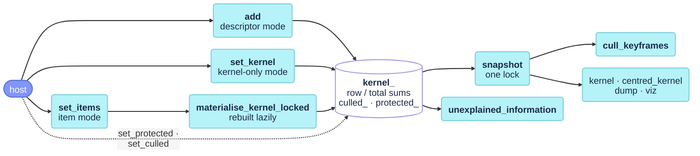

# The store

The core of `PlaceCell` (`src/placecell.cpp`): an id-mapped, append-only store of views (the host's keyframes) plus the similarity kernel over them, filled in one of three ways that never mix, with the flags the culler reads and the views of the kernel that the culler, the viz and the dumps take. Its two consumers have their own pages: the [insertion query](placecell_query.md) and the [culler](placecell_cull.md); the [item mode](placecell_items.md) and the [event hooks](placecell_events.md) too.


```mermaid
---
config:
  htmlLabels: false
  themeCSS: "
    text, tspan { font-family: var(--md-text-font-family), sans-serif; }
    .edgePath .path, .flowchart-link { stroke: var(--md-mermaid-edge-color); }
    .marker, marker path { fill: var(--md-mermaid-edge-color); stroke: var(--md-mermaid-edge-color); }
    .edgeLabel rect, .labelBkg { fill: var(--md-default-bg-color); opacity: 1; }
    .edgeLabel text, .edgeLabel tspan { fill: var(--md-default-fg-color); }"
  themeVariables:
    fontSize: 19px
  flowchart:
    htmlLabels: false
    wrappingWidth: 320
    nodeSpacing: 25
    rankSpacing: 40
    curve: basis
    padding: 14
---
flowchart LR
    HOST([host]) --> ADD("`**add**
    descriptor mode`")
    HOST --> SK("`**set_kernel**
    kernel-only mode`")
    HOST --> SI("`**set_items**
    item mode`")
    ADD --> K[("`**kernel_**
    row / total sums
    culled_ · protected_`")]
    SK --> K
    SI --> MAT("`**materialise_kernel_locked**
    rebuilt lazily`") --> K
    HOST -. "set_protected · set_culled" .-> K
    K --> SNAP("`**snapshot**
    one lock`")
    SNAP --> CK("`**cull_keyframes**`")
    SNAP --> VIEWS("`kernel · centred_kernel
    dump · viz`")
    K --> Q("`**unexplained_information**`")

    click ADD "#add"
    click SK "#set_kernel"
    click SI "../placecell_items/#set_items"
    click MAT "../placecell_items/#materialise_kernel_locked"
    click SNAP "#snapshot"
    click CK "../placecell_cull/#cull_keyframes"
    click Q "../placecell_query/#unexplained_information"

    %% VSLAM-LAB logo squares: cyan #b5f3f9, periwinkle #8195fb, lavender #a59ddf
    classDef entry fill:#8195fb,stroke:#5f74d6,stroke-width:2px,color:#fff
    classDef step fill:#b5f3f9,stroke:#7fcfd8,stroke-width:2px,color:#1b2a4a
    classDef store fill:#fff,stroke:#a59ddf,stroke-width:2px,color:#1b2a4a

    class HOST entry
    class ADD,SK,SI,MAT,SNAP,CK,VIEWS,Q step
    class K store
    linkStyle default stroke-width:2px
```

## State

Every member below is guarded by the one `mutex_`; each method takes what it needs under the lock and does the linear algebra outside it.

The kernel `kernel_` is the n×n float similarity, row and column $i$ = internal id $i$; `external_ids_` maps a row back to the host's id and `ids_` the other way. `kernel_row_sums_` and `kernel_total_sum_` are its row sums and total, in double, so the insertion query can centre out of sample without sweeping the kernel; a NaN row sum marks an item view with an empty set. `culled_` and `protected_` hold one flag per row. [`add`](#add) grows all of them by one row, [`set_kernel`](#set_kernel) writes them whole, and in item mode [`materialise_kernel_locked`](placecell_items.md#materialise_kernel_locked) rebuilds the kernel and its sums from the shared counts, which is why those three are `mutable`.

The mode is fixed by the first filling call and reset only by [`clear`](#clear). The descriptor mode keeps `descriptors_` (append-only, never relocated), the size of the first one in `descriptor_size_`, and `size_mismatch_` once any descriptor had another size. The kernel-only mode is `kernel_only_`. The item mode (`item_mode_`, `items_`, `item_norms_`, `item_counts_`, `item_index_`, `kernel_dirty_`) is described on [its page](placecell_items.md). The diagnostics (`profiler_`, `recorder_`, `last_history_over_budget_`) belong to the [event hooks](placecell_events.md).

## Construction and diagnostics

### `PlaceCell::PlaceCell` {#placecell data-toc-label="PlaceCell"}

```cpp
PlaceCell::PlaceCell(const Options& options)
```

Creates an empty store whose mode the first filling call will decide. `options.verbosity` sets the process-wide Logger level unless `PLACECELL_VERBOSITY` was set in the environment; `options.profile` and `options.record` switch the store's own Profiler and Recorder on (both true by default); `options.name` labels the profile report (`"PlaceCell"`). The profiler rows are declared in a fixed order (`add`, `set_kernel`, `set_items`, the two queries, `cull_keyframes` and its four sub-rows) so the report does not depend on which call came first. The default constructor delegates with `Options{}`; `~PlaceCell` prints the profile table when `options.report_on_destruction` is set (false by default).

!!! info "Cost"
    **Time O(1), space O(1)**

### `PlaceCell::print_profile` {#print_profile data-toc-label="print_profile"}

```cpp
void PlaceCell::print_profile() const
```

Prints the Profiler's count / median / p95 / max table through `Logger::print`, which bypasses the verbosity gate, so the table appears whatever the level; nothing when no sample was recorded.

!!! info "Cost"
    **Time O(rows), space O(rows)**

### `PlaceCell::dump` {#dump data-toc-label="dump"}

```cpp
void PlaceCell::dump(const std::string& directory) const
```

Writes the store to `directory` for offline inspection, creating it: `kernel.npy` (raw), `kernel_centred.npy`, `views.csv` (internal id, external id, culled, protected, and $|P_i|$ in item mode, 0 otherwise), the Recorder's CSVs and `profile.csv`, then logs the counts at INFO. `tools/plot_placecell.py` is its reader.

!!! note "Not one snapshot"
    The raw kernel, the centred kernel and the item sizes are taken under three separate locks, so with a concurrent `add` or `set_items` the files can describe slightly different stores; dump a quiet store.

!!! info "Cost"
    **Time O(n²), space O(n²)**, dominated by the two kernel copies and the centring.

## Filling the store

### `PlaceCell::add` {#add data-toc-label="add"}

```cpp
PlaceCell::InternalId PlaceCell::add(const ExternalId id, Eigen::VectorXf descriptor)
```

Stores a global descriptor under the host's `id` and grows the kernel by the new view's row and column of dot products, accumulated in double (unit descriptors make the dot the cosine), with 1 on the diagonal; the row sums and the total sum the centred query reads are updated in the same step. Returns the view's internal id, the row it got. The call is idempotent: a known id returns its existing row and keeps the descriptor it already has. A descriptor whose size differs from the store's writes NaN into its row and marks the store with `size_mismatch_`, after which the descriptor query returns NaN.

$$
K_{in} = K_{ni} = \mathbf{d}_i \cdot \mathbf{d}_n \quad (i < n), \qquad K_{nn} = 1, \qquad r_n = 1 + \sum_{i<n} K_{in}
$$

Called from `MegaLocPlaceCell::add_image` ([`megaloc_placecell.cpp`](https://github.com/alejandrofontan/placecell/blob/main/src/megaloc/megaloc_placecell.cpp#L41 "existing != invalid_id")), the synthetic demo and the Python binding; each new view is reported by [`on_add`](placecell_events.md#on_add).

!!! warning "Refused on another mode"
    On a kernel-only or item-backed store the call logs an ERROR and returns `invalid_id`: there are no descriptors to take the new row's dots against.

!!! info "Cost"
    **Time O(n d), space O(n + d)** for n stored views of dimension d, all under `mutex_`. Timed as `add`, with size the stored views before the call.

### `PlaceCell::set_kernel` {#set_kernel data-toc-label="set_kernel"}

```cpp
PlaceCell::KernelReport PlaceCell::set_kernel(const Eigen::MatrixXf& similarity, const std::vector<ExternalId>& ids,
                                              const KernelOptions& options)
```

Initialises an empty store from a host-supplied n×n similarity: row $i$ becomes the view `ids[i]` (or $i$ when `ids` is empty), every view alive and unprotected, and the store becomes kernel-only, with no descriptors. The overload without `options` forwards the defaults.

The matrix is fixed up in double as `options` asks: `symmetrise` (true) stores $(S + S^\top)/2$, `unit_diagonal` (true) sets the diagonal to exactly 1, `psd_check` (true) computes the spectrum with `SelfAdjointEigenSolver`, and `clip_to_psd` (false) also clips the negative eigenvalues at 0 and, with a unit diagonal, renormalises as a correlation so the result stays PSD:

$$
S \leftarrow V \max(\Lambda, 0)\, V^\top, \qquad S \leftarrow D^{-1/2} S D^{-1/2}, \quad D = \operatorname{diag}(S)
$$

The float kernel is stored with the row and total sums [`add`](#add) would have kept. Returns a `KernelReport`: the input's largest asymmetry and diagonal deviation, the extreme eigenvalues and how many are negative (NaN when the spectrum was not computed), whether it clipped, and the duration. [`on_set_kernel`](placecell_events.md#on_set_kernel) logs it, and warns above `options.asymmetry_warn` (0.05) and on negative eigenvalues that were not clipped.

Called from [`kernel_demo.cpp`](https://github.com/alejandrofontan/placecell/blob/main/examples/kernel_demo.cpp#L214 "cell.cull_keyframes("), the synthetic demo's kernel-only twin and the Python binding (VSLAM-LAB's `rgb_placecell` selection).

!!! warning "Clipping is opt-in"
    `clip_to_psd` is off by default. An indefinite matrix, such as VPR-LAB's rotation-min `D.npy`, is stored as is, and the culler is then broken rather than degraded (issue #3); pass `clip_to_psd` (`--clip` in `kernel_demo`).

!!! warning "Throws"
    `std::invalid_argument` for an empty or non-square matrix, an `ids` size that is not n, duplicate ids, or a NaN entry; `std::logic_error` when the store is not empty, checked again under the lock after the decomposition in case a concurrent `add` slipped in.

!!! info "Cost"
    **Time O(n³) with `psd_check` or `clip_to_psd`, O(n²) otherwise; space O(n²)**. The decomposition runs outside the lock. Timed as `set_kernel`.

### `PlaceCell::clear` {#clear data-toc-label="clear"}

```cpp
void PlaceCell::clear()
```

Resets the store to empty, for a host system reset: every view, descriptor and item set, the kernel and its sums, the mode flags and the culled / protected flags are dropped, and the next filling call decides the mode again. The Profiler and the Recorder are kept, so the profile and the history span resets; the INFO line says so. Called from AllFeature-VSLAM's `PlaceRecognitionMegaLoc` and `KeyframeInformation` reset paths and the Python binding.

!!! warning "Not during a cull"
    `cull_keyframes` marks its culls by row index after the host callback returns; a `clear` from another thread while a cull runs makes that write land in the new store (see [its locking note](placecell_cull.md#cull_keyframes)).

!!! info "Cost"
    **Time O(n), space O(1)**

## Culling flags

### `PlaceCell::set_protected` {#set_protected data-toc-label="set_protected"}

```cpp
void PlaceCell::set_protected(const ExternalId id, const bool value)
```

Marks (or, with `value = false`, unmarks) a view the culler may use as an explainer but never proposes. [`is_protected`](#accessors) reads it back. Unknown ids are ignored.

!!! info "Cost"
    **Time O(1), space O(1)**

### `PlaceCell::set_culled` {#set_culled data-toc-label="set_culled"}

```cpp
void PlaceCell::set_culled(const ExternalId id)
```

Records a view the host removed outside `cull_keyframes` (another culling rule): it keeps its kernel row and becomes history, so the culler keeps it explained. Views culled through the culler's callback are marked by the culler itself. Unknown ids are ignored; there is no way back, since culling is irreversible. The synthetic demo uses it to give its kernel-only twin the same history as the descriptor store.

!!! info "Cost"
    **Time O(1), space O(1)**

## Kernel views

### `PlaceCell::snapshot` {#snapshot data-toc-label="snapshot"}

```cpp
PlaceCell::Snapshot PlaceCell::snapshot(const bool centred) const
```

Copies the kernel, the external ids (index = internal id) and the culled and protected flags under one lock, after [`materialise_kernel_locked`](placecell_items.md#materialise_kernel_locked), so the pieces agree. With `centred`, the kernel is then centred outside the lock by [`centre_kernel`](#centre_kernel) over its [`usable_rows`](#usable_rows). The viz module, [`dump`](#dump), [`centred_kernel`](#centred_kernel) and [`cull_keyframes`](placecell_cull.md#cull_keyframes) take their copies through it.

!!! info "Cost"
    **Time O(n²), space O(n²)**; the copy is under `mutex_`, the centring outside it.

### `PlaceCell::centre_kernel` {#centre_kernel data-toc-label="centre_kernel"}

```cpp
void PlaceCell::centre_kernel(Eigen::MatrixXf& kernel, const std::vector<char>& usable)
```

Double-centres a kernel snapshot in place over its usable rows and renormalises it to unit diagonal: the correlation of the mean-centred descriptors, which removes the common-mode floor of image embeddings so that unrelated pairs sit near 0 and near-duplicates stay high (paper eq. `centring`). With the $m$ usable rows copied into a double matrix $S$:

$$
C_{ij} = S_{ij} - r_i - r_j + t \quad (C = J S J,\ J = I - \tfrac{1}{m}\mathbf{1}\mathbf{1}^{\!\top}), \qquad K_{ij} \leftarrow \frac{C_{ij}}{\sqrt{C_{ii}\, C_{jj}}}
$$

with $r$ the row means and $t$ their mean, each diagonal floored at $10^{-9}$ before the square root. The result is PSD of rank $m - 1$, which is why every solve on it adds a diagonal jitter. Unusable rows are left exactly as they were, and with $m < 3$ nothing changes. A static helper: it touches only its argument.

!!! note "Two centrings, one formula"
    The insertion query centres out of sample with the same formula from the maintained row and total sums (see [`query_system_locked`](placecell_query.md#query_system_locked)), so the culler and the query agree; their thresholds differ in what they count, $m$ usable rows here, stored views there.

!!! info "Cost"
    **Time O(m²), space O(m²)** for the double copy.

### `PlaceCell::usable_rows` {#usable_rows data-toc-label="usable_rows"}

```cpp
std::vector<char> PlaceCell::usable_rows(const Eigen::MatrixXf& kernel)
```

Decides which rows of a kernel snapshot the culler and the centring may use, so that every entry among the usable rows is finite. A view is unusable when it cannot be compared with any other view, i.e. every off-diagonal entry of its row is NaN: a descriptor whose size mismatched the store's, or an empty item set (for $n = 1$, a NaN diagonal). The NaN such a view leaves in every other row is not held against those rows, since it disappears with the culprit's column. A second pass drops any survivor still NaN against another survivor; NaN can only enter the kernel as a whole row and column, so that pass is defensive. A static helper.

Returns one flag per row, 1 = usable.

!!! info "Cost"
    **Time O(n²), space O(n)**

### `PlaceCell::kernel` {#kernel data-toc-label="kernel"}

```cpp
Eigen::MatrixXf PlaceCell::kernel() const
```

A copy of the raw kernel, materialised first in item mode. It is consistent with [`external_ids`](#external_ids) only when both are taken without a concurrent fill; [`snapshot`](#snapshot) takes them under one lock.

!!! info "Cost"
    **Time O(n²), space O(n²)**, under `mutex_`.

### `PlaceCell::centred_kernel` {#centred_kernel data-toc-label="centred_kernel"}

```cpp
Eigen::MatrixXf PlaceCell::centred_kernel() const
```

`snapshot(true).kernel`: exactly the kernel `cull_keyframes` marginalises with `parameters.centred`, equal to the raw kernel below 3 usable views.

!!! info "Cost"
    **Time O(n²), space O(n²)**

### `PlaceCell::external_ids` {#external_ids data-toc-label="external_ids"}

```cpp
std::vector<PlaceCell::ExternalId> PlaceCell::external_ids() const
```

The host's id of every row, in internal-id (insertion) order.

!!! info "Cost"
    **Time O(n), space O(n)**

## Accessors

One fact each, read under `mutex_`; none touches the kernel. **`has`** says whether an id is stored. **`descriptor`** returns a stable pointer to the stored descriptor (append-only storage, never relocated), or `nullptr` for an unknown id and for every id of a kernel-only or item-backed store. **`kernel_only`** and [**`item_mode`**](placecell_items.md#item_mode) say which mode the store is in (both false on a descriptor store). **`internal_id`** is the kernel row of an id, `invalid_id` when unknown. **`size`** is the number of stored views, alive and history. **`is_protected`** and **`is_culled`** read the two flags, false for an unknown id. [**`items`**](placecell_items.md#items) is on the item page.
