# The culling shell

The method-agnostic part of `cull_keyframes` (`src/placecell_cull.cpp`): it snapshots the store, fixes which views are alive, history and candidates in scope, and hands them to one culling method, today [gram-greedy](placecell_gram_greedy.md).

```mermaid
---
config:
  htmlLabels: false
  themeCSS: "
    text, tspan { font-family: var(--md-text-font-family), sans-serif; }
    .edgePath .path, .flowchart-link { stroke: var(--md-mermaid-edge-color); }
    .marker, marker path { fill: var(--md-mermaid-edge-color); stroke: var(--md-mermaid-edge-color); }
    .edgeLabel rect, .labelBkg { fill: var(--md-default-bg-color); opacity: 1; }
    .edgeLabel text, .edgeLabel tspan { fill: var(--md-default-fg-color); }"
  themeVariables:
    fontSize: 19px
  flowchart:
    htmlLabels: false
    nodeSpacing: 25
    rankSpacing: 30
    curve: basis
    padding: 14
---
flowchart LR
    HOST([host]) --> PARSE("`**parse**
    method · objective`")
    PARSE --> SNAP("`**snapshot**
    one lock`")
    SNAP --> USE("`**usable rows**
    centring`")
    USE --> SPLIT("`**split_rows**
    alive / history · window`")
    SPLIT --> BUDGET("`**set_budget**
    tau · stop count · cap`")
    BUDGET --> CAND("`**mark_candidates**
    protections`")
    CAND --> GG("`**gram_greedy::cull**
    one cull at a time`")
    GG --> REP([report · on_cull_call])
    SNAP -. "< 3 views" .-> REP
    BUDGET -. "at stop count" .-> REP
    CAND -. "no candidate" .-> REP

    click PARSE "#parse_cull_method"
    click SNAP "../placecell/#snapshot"
    click USE "../placecell/#usable_rows"
    click SPLIT "#split_rows"
    click BUDGET "#set_budget"
    click CAND "#mark_candidates"
    click GG "../placecell_gram_greedy/#cull"

    %% VSLAM-LAB logo squares: cyan #b5f3f9, periwinkle #8195fb, lavender #a59ddf
    classDef entry fill:#8195fb,stroke:#5f74d6,stroke-width:2px,color:#fff
    classDef step fill:#b5f3f9,stroke:#7fcfd8,stroke-width:2px,color:#1b2a4a

    class HOST,REP entry
    class PARSE,SNAP,USE,SPLIT,BUDGET,CAND,GG step
    linkStyle default stroke-width:2px
```



## Data structures

What the shell hands a method. Both come from the internal header `src/placecell_cull_method.h` (not installed), shared by every method, so a method sees neither the store nor its lock.

### `CullScope` {#cullscope data-toc-label="CullScope"}

```cpp
struct CullScope
{
    Eigen::MatrixXf similarity;
    std::vector<PlaceCell::ExternalId> row_ids;
    std::vector<int> alive;
    std::vector<int> history;
    std::vector<char> candidate;
    double tau{0.0};          // +inf in count-driven mode
    int stop_at{0};           // stop once this many alive views remain in scope
    int max_per_call{0};      // 0 = unlimited
    bool centred{false};
    bool local{false};
    CullObjective objective{CullObjective::unique};
};
```

[`cull_keyframes`](#cull_keyframes) fills every field; the method only reads it. `similarity` is the snapshot of the kernel, centred when `parameters.centred`, and `row_ids` its external ids. `alive` and `history` are kernel rows: the usable rows in scope, split by the culled flag, in increasing row order (insertion order). `candidate` has one flag per entry of `alive`: whether that view may be proposed, i.e. is not protected. `tau`, `stop_at` and `max_per_call` are the budget; `centred` and `local` only serve the method's issue-#5 warning; `objective` is the parsed `parameters.objective`.

### `CullExecutor` {#cullexecutor data-toc-label="CullExecutor"}

```cpp
class CullExecutor
{
public:
    using MarkCulled = std::function<void(int row)>;
    CullExecutor(const PlaceCell::CullCallback& try_cull, const std::vector<PlaceCell::ExternalId>& row_ids,
                 MarkCulled mark_culled);
    bool operator()(int row);   // the host's answer; true = the view is gone and is history here
    double ms() const;          // total time spent in the host callback
    int count() const;          // accepted culls
};
```

The only way a cull reaches the store. `operator()` calls the host's `try_cull` with the row's external id, with the store lock not held; on acceptance it calls `mark_culled(row)`, which [`cull_keyframes`](#cull_keyframes) supplies as a lambda that sets `culled_[row]` under `mutex_`. It adds up the callback time, which the shell records as `cull_keyframes/host_callback` and subtracts from the call's own timing.

### `CullMethod`, `CullObjective` {#enums data-toc-label="CullMethod, CullObjective"}

```cpp
enum class CullMethod { gram_greedy };
enum class CullObjective { unique, minimax, total_loss };
```

The parsed forms of `CullParameters::method` and `CullParameters::objective`, see [`parse_cull_method`](#parse_cull_method) and [`parse_cull_objective`](#parse_cull_objective). The method switches on `CullMethod`; `CullObjective` travels in the scope to [`gram_greedy::propose`](placecell_gram_greedy.md#propose).

## Functions

### `parse_cull_method` {#parse_cull_method data-toc-label="parse_cull_method"}

```cpp
CullMethod parse_cull_method(const std::string& name)
```

Turns `CullParameters::method` into a `CullMethod`: `"gram-greedy"` is the only name. Any other name logs an ERROR and throws `std::invalid_argument`, listing the options. Called first thing in [`cull_keyframes`](#cull_keyframes), before the profiler timer starts, so an invalid call leaves no report and no profile sample.

!!! info "Cost"
    **Time O(1), space O(1)**

### `parse_cull_objective` {#parse_cull_objective data-toc-label="parse_cull_objective"}

```cpp
CullObjective parse_cull_objective(const std::string& name)
```

Turns `CullParameters::objective` into a `CullObjective`: `"unique"`, `"minimax"` or `"total-loss"`. Any other name logs an ERROR and throws `std::invalid_argument`, listing the options. Called in [`cull_keyframes`](#cull_keyframes) right after [`parse_cull_method`](#parse_cull_method). What each objective does: [`gram_greedy::propose`](placecell_gram_greedy.md#propose).

!!! info "Cost"
    **Time O(1), space O(1)**

### `PlaceCell::cull_keyframes` {#cull_keyframes data-toc-label="cull_keyframes"}

```cpp
PlaceCell::CullReport PlaceCell::cull_keyframes(const CullParameters& parameters,
                                                const CullCallback& try_cull,
                                                const std::vector<ExternalId>* local_window)
```

Culls redundant keyframes, one at a time, as long as every view ever inserted stays explained within the budget $\tau$ = `max_unexplained`. The host performs each removal through `try_cull`; a view becomes history here only when the callback returns true. `cull_keyframes` is the method-agnostic shell: it prepares a `CullScope` and hands it to the method named by `parameters.method`, today always [`gram_greedy::cull`](placecell_gram_greedy.md#cull), which decides the order of the culls.

It parses the method and the objective ([`parse_cull_method`](#parse_cull_method), [`parse_cull_objective`](#parse_cull_objective)), then takes the kernel, the external ids and the culled / protected flags in one lock with [`snapshot`](placecell.md#snapshot)`(false)`. On that copy it drops the rows [`usable_rows`](placecell.md#usable_rows) rejects (a NaN kernel row: a descriptor-size mismatch or an empty item set, WARN once) and, with `parameters.centred`, double-centres it with [`centre_kernel`](placecell.md#centre_kernel) over the usable rows, alive and history. The three file-local helpers then fill the rest of the scope: [`split_rows`](#split_rows) (alive and history in scope, with the local window), [`set_budget`](#set_budget) (tau, stop count, cap, objective) and [`mark_candidates`](#mark_candidates) (the unprotected alive views). Finally it wraps `try_cull` in a `CullExecutor` whose mark-culled function sets `culled_[row]` under `mutex_`, and dispatches.

`parameters` is described field by field in the comments of `CullParameters` in `include/placecell/placecell.h`. `try_cull` receives the external id of each proposed view and returns true when the host removed it, false to keep it alive and out of the running for the rest of this call (e.g. a deferred erase). `local_window` is the list of external ids of the host's covisibility window, or `nullptr` for the whole map; ids not in the store are ignored.

Returns a `CullReport`. The shell sets `views_total` (every row ever inserted, usable or not), `alive_after` on the early returns, and `candidates`; the method appends one `CulledView` per accepted cull to `culled` and fills `alive_after`, `worst_history`, `history_over_budget`, `reached_max_per_call`, `alive_ids` and `alive_unique_information` through [`gram_greedy::report`](placecell_gram_greedy.md#report). Every exit path, early or not, passes the report to [`on_cull_call`](placecell.md#on_add-on_set_kernel-on_set_items-on_query-on_cull_call) for the Recorder and the log.

```cpp
placecell::PlaceCell::CullParameters params;
params.max_unexplained = 0.3f;                      // tau
auto report = cell.cull_keyframes(params, [&](placecell::PlaceCell::ExternalId id) {
    return map.erase(id);                           // the host decides; true = removed
});
```

!!! note "Locking"
    Only the snapshot runs under `mutex_`; the centring, the scope, the method and the host callback run without it, so the callback may take the host's own map lock. The mark-culled function takes `mutex_` briefly for each accepted view, after the callback has returned. The store may grow during a call (an `add` from the callback or another thread is safe: rows are append-only, and a new view is simply not in this call's scope), but a [`clear`](placecell.md#clear) during a call is not: the mark-culled function would then write the row index of the old store.

!!! warning "Early returns"
    The call ends without culling, and with the report as filled so far, when there are fewer than 3 views, when the alive views in scope are already at the stop count, or when none of them is a candidate. On the first of these, `alive_after` is left at 0 even when views are alive: it is set only after the scope is built.

!!! warning "Unknown method or objective"
    `parameters.method` and `parameters.objective` are parsed before anything else; an unknown name logs an ERROR and throws `std::invalid_argument`, with no report and no profile sample.

!!! info "Cost"
    **Time O(n²) + O(|H| |A|) with a window + the method, space O(n²)**, with n the stored views and |A|, |H| the alive and history rows in scope (the method's cost is on [its page](placecell_gram_greedy.md#cull)). The O(n²) copy of the kernel, plus an O(n²) rebuild in item mode when the kernel is stale, is the only part under `mutex_`; [`usable_rows`](placecell.md#usable_rows) and [`centre_kernel`](placecell.md#centre_kernel) are O(n²) each on the copy. Timed as `cull_keyframes` (the whole call minus the host callback, sizes |A| and |H|), with sub-rows `snapshot+centring`, the method's `inverse` and `greedy`, and `host_callback`.

Called from AllFeature-VSLAM's `LocalMapping::cull_keyframes_information` ([`LocalMapping.cc#L651`](https://github.com/alejandrofontan/AllFeature-VSLAM/blob/main/src/LocalMapping.cc#L651)), the offline selection in [`kernel_demo.cpp`](https://github.com/alejandrofontan/placecell/blob/main/examples/kernel_demo.cpp#L214 "cell.cull_keyframes(") and [`synthetic_demo.cpp`](https://github.com/alejandrofontan/placecell/blob/main/examples/synthetic_demo.cpp#L135 "cell.cull_keyframes("), [`megaloc_embedder_smoke.cpp`](https://github.com/alejandrofontan/placecell/blob/main/examples/megaloc_embedder_smoke.cpp#L110 "store.cull_keyframes("), and the Python binding ([`bindings.cpp`](https://github.com/alejandrofontan/placecell/blob/main/python/bindings.cpp#L236 "self.cull_keyframes(")).

### `split_rows` {#split_rows data-toc-label="split_rows"}

```cpp
void split_rows(CullScope& scope, const std::vector<char>& usable, const std::vector<char>& row_culled,
                const std::vector<PlaceCell::ExternalId>* local_window)
```

Decides which rows the method may marginalise over (`scope.alive`) and which must stay explained (`scope.history`). The usable rows are split by the culled flag, in row order, which is insertion order. Without a window that is the whole map. With a window $\mathcal{W}$, both sets are reduced to the host's covisibility neighbourhood:

$$
A \leftarrow A \cap \mathcal{W}, \qquad H \leftarrow \{\, h \in H : \operatorname*{arg\,max}_{a \in A} K_{ha} \in \mathcal{W} \,\}
$$

The best explainer is taken over the alive views of the whole map, before the reduction, on the kernel the method will see (centred or raw). Far-away history cannot veto a local cull, and far-away views cannot explain a local one; this is the paper's *Local scope*.

`scope` arrives with `similarity` and `row_ids` and leaves with `alive` and `history`. `usable` and `row_culled` have one flag per kernel row. `local_window` is the host's window, or `nullptr`.

!!! note "History without an alive explainer"
    With a window and no alive view at all, every history row is dropped: no row has a best explainer, so none can be in the window.

!!! info "Cost"
    **Time O(n), plus O(|H| |A|) with a window; space O(n)**, with |A| and |H| taken before the reduction. Not timed on its own: it falls in the parent `cull_keyframes` row.

### `set_budget` {#set_budget data-toc-label="set_budget"}

```cpp
void set_budget(CullScope& scope, const PlaceCell::CullParameters& parameters, const CullObjective objective,
                const bool local)
```

Fixes how far the method may go. Tau-driven (the default), it may cull while every view stays within $\tau$ = `max_unexplained` and stops at `min_keyframes` alive views in scope. Count-driven (`target_alive > 0`), $\tau = +\infty$, so neither a view's own unique information nor the history bounds a cull, and the method stops at `max(min_keyframes, target_alive)` alive views: the offline "keep the $N$ least redundant views" selection, where `report.alive_after` says how many actually survived. In both modes `max_per_call` caps the culls of one call and `objective` sets their order.

`scope` receives `stop_at`, `tau`, `max_per_call`, `centred`, `local` and `objective`. `parameters` supplies the first four, `objective` is the parsed `parameters.objective`, and `local` says whether a window was given.

!!! info "Cost"
    **Time O(1), space O(1)**

### `mark_candidates` {#mark_candidates data-toc-label="mark_candidates"}

```cpp
int mark_candidates(CullScope& scope, const PlaceCell::CullParameters& parameters,
                    const std::vector<char>& row_protected)
```

Marks which alive views in scope the method may propose. A view is protected, never a candidate but still an explainer, when it is row 0 with `protect_first` (it anchors the host's map), one of the last `protect_last` rows in insertion order, or marked with [`set_protected`](placecell.md#set_protected).

`scope` arrives with `alive` and leaves with `candidate`, one flag per entry of `alive`. `row_protected` has one flag per kernel row.

Returns the number of candidates; the shell stores it as `report.candidates` and returns early when it is 0.

!!! note "Protections count every row"
    `protect_last` counts from the end of all stored rows, culled or unusable ones included, so when the newest rows are already history it protects fewer alive views. `protect_first` protects row 0 even if it has been culled by [`set_culled`](placecell.md#set_culled).

!!! info "Cost"
    **Time O(|A|), space O(|A|)**. Not timed on its own.

