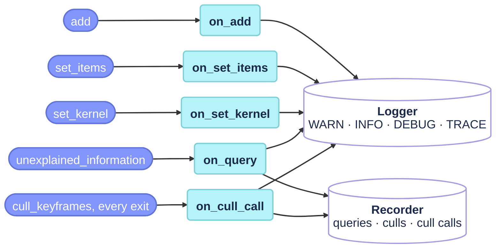

# Event hooks

The five `on_*` hooks of `src/placecell_events.cpp`: the store calls one per event, and it turns that event into a Recorder entry (the history the dumps and the plots read) and Logger lines, so the maths in `placecell.cpp` and `placecell_cull.cpp` carries no instrumentation. Timing is the exception and stays inline, because a `Profiler::Scope` has to bracket the work.



All five are private `const` members of `PlaceCell`, declared in `include/placecell/placecell.h`; the Recorder and `last_history_over_budget_` they write are `mutable`. The levels follow placecell's policy: WARN for a degraded path, INFO for a one-off fact, DEBUG one line per add / cull / call, TRACE per query; placecell defaults to `warn`, so a host sees only the WARN lines unless it raises the level. Numbers are printed with three decimals by a file-local `fixed3`.

!!! note "Once per process"
    The `WARN_ONCE` lines use a static flag per call site: each fires once per process, whatever the number of stores, and a [`clear`](placecell.md#clear) does not re-arm it.

## Functions

### `PlaceCell::on_add` {#on_add data-toc-label="on_add"}

```cpp
void PlaceCell::on_add(const ExternalId id, const InternalId internal, const bool size_mismatch) const
```

Reports a view stored by [`add`](placecell.md#add). When its descriptor size differs from the store's, it warns once that the view's kernel row is NaN and that the descriptor query will return NaN from now on; otherwise the event is only a DEBUG line with the id and the kernel row it got. Nothing is recorded: the Recorder keeps queries and culls, not insertions (the host's own insertion decisions go to it through `record_decision`).

`id` is the host's external id, `internal` the kernel row, `size_mismatch` whether the descriptor size differed.

!!! info "Cost"
    **Time O(1), space O(1)**. Once per new view, after the store's lock is released.

### `PlaceCell::on_set_items` {#on_set_items data-toc-label="on_set_items"}

```cpp
void PlaceCell::on_set_items(const ExternalId id, const InternalId internal, const std::size_t items,
                             const std::size_t added, const std::size_t removed, const bool new_view) const
```

Reports an item set stored or refreshed by [`set_items`](placecell_items.md#set_items). An empty set warns once: the view's kernel row is NaN (0/0), and `cull_keyframes` and the queries ignore it until it gets items again. Every call is a DEBUG line with the row, the item count and the diff against the previous set.

`items` is the size of the new set, `added` / `removed` the diff against the previous one, and `new_view` whether this created the view (true) or refreshed it (false).

!!! info "Cost"
    **Time O(1), space O(1)**. Once per `set_items` call.

### `PlaceCell::on_set_kernel` {#on_set_kernel data-toc-label="on_set_kernel"}

```cpp
void PlaceCell::on_set_kernel(const KernelReport& report, const KernelOptions& options) const
```

Reports a host matrix loaded by [`set_kernel`](placecell.md#set_kernel): one INFO line with the number of views, the load time, the largest asymmetry (and whether it was symmetrised), the largest deviation of the diagonal from 1 (and whether it was set to 1), and the spectrum, its extremes, how many eigenvalues are negative and whether it was clipped, or "spectrum not checked" when `psd_check` was off. Two WARNs follow when they apply: the asymmetry exceeds `options.asymmetry_warn`, or the kernel has negative eigenvalues that were not clipped.

`report` is what `set_kernel` found and did; `options` are the options it ran with.

!!! warning "An unclipped indefinite kernel"
    The negative-eigenvalue WARN is the only signal that the culler will misbehave: on such a kernel it is broken rather than degraded, because views whose inverse pivot comes out non-positive are skipped without a word (issue #3). The WARN names `KernelOptions::clip_to_psd` as the fix.

!!! info "Cost"
    **Time O(1), space O(1)**. Once per `set_kernel` call.

### `PlaceCell::on_query` {#on_query data-toc-label="on_query"}

```cpp
void PlaceCell::on_query(const Information& information, const int stored, const int window_size,
                         const bool centred, const double ms) const
```

Reports one insertion query, from either [`unexplained_information`](placecell_query.md#unexplained_information) overload (descriptor or items). It records a `Recorder::Query` (the unexplained information, the number of explainers, the best explainer and its similarity, whether the kernel was centred, the store size and the window size), warns once when the query returned NaN (a store / query mismatch, or an empty item query), and writes a TRACE line.

`information` is the query's result, `stored` the number of stored views, `window_size` the size of the host's window or −1 without one, `centred` whether the query was centred, `ms` its duration.

!!! info "Cost"
    **Time O(1), space O(1) per query** (one Recorder row). Once per query, the hottest of the five: the TRACE line is only built when that level is on.

### `PlaceCell::on_cull_call` {#on_cull_call data-toc-label="on_cull_call"}

```cpp
void PlaceCell::on_cull_call(const CullParameters& parameters, const CullReport& report, const bool local,
                             const double ms) const
```

Reports one [`cull_keyframes`](placecell_cull.md#cull_keyframes) call, from every exit path, early or not. It records a `Recorder::CullCall` (the tau in force, centred / local, the report's counts, the worst history row, the duration, and the alive ids with their unique information) and one `Recorder::Cull` per culled view (its id, unique information, worst unexplained view after the cull, alive count after it, and the tau). The log gets a DEBUG line per culled view and one per call, the latter with the scope, the mode, the counts, the worst history row and whether the per-call cap was reached.

The tau in force is `parameters.max_unexplained` in tau-driven mode and NaN in count-driven mode (`target_alive > 0`), where the culler runs with tau = +∞; the viz alive strip then draws no tau line and titles the call "count-driven", and `tools/plot_placecell.py` skips it the same way.

When tau was lowered below earlier culls, the history can hold rows above budget. The hook says so at INFO once per change of `report.history_over_budget` rather than on every call: when the count becomes non-zero or changes, and once more when the history is back within tau. It remembers the last count in `last_history_over_budget_`, which [`clear`](placecell.md#clear) resets.

`parameters` are the call's parameters, `report` its final report, `local` whether a window was given, `ms` the call's duration without the host callback.

!!! note "What the Recorder keeps"
    Only the latest `CullCall` keeps its alive ids and unique-information vectors; the Recorder empties them on the previous call when a new one arrives, so the history of culls and calls grows by counts, not by the map size.

!!! warning "Concurrent culls"
    `last_history_over_budget_` is a plain `mutable int` read and written without a lock, and `on_cull_call` runs with the store unlocked. Two threads calling `cull_keyframes` on the same store at the same time race on it (a data race, not just a duplicated INFO line). The Recorder and the Logger have their own locks.

!!! info "Cost"
    **Time O(|culled| + |A|), space O(|culled| + |A|)**: one Recorder row per culled view, and a copy of the alive ids and scores. Once per `cull_keyframes` call, inside its `cull_keyframes` profile row.
