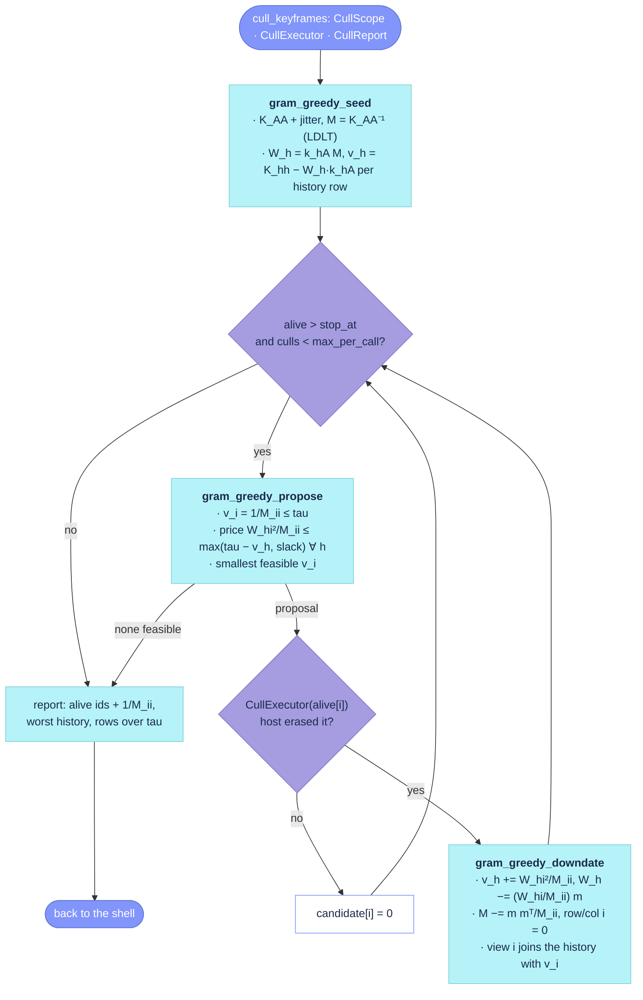

# `src/placecell_gram_greedy.cpp`

## State

| Member of `GramGreedyState` | Holds | Written by |
|---|---|---|
| `M` | `K_AA⁻¹` over `scope.alive`, jittered; the row and column of a culled view are zero | [`gram_greedy_seed`](#gram_greedy_seed), [`gram_greedy_downdate`](#gram_greedy_downdate) |
| `W_rows` | one vector per history row, `W_h = k_hA M` over the alive columns | seed (rows in scope), downdate (one row per accepted cull) |
| `v_h` | the unexplained information of each history row, same order as `W_rows` | seed, downdate |
| `removed` | alive positions culled in this call | downdate |

A `GramGreedyProposal` is one candidate: its position in `scope.alive` (−1 = none feasible),
its unique information `v_i` and the worst unexplained view right after culling it.

## Call graph

- **[`cull_gram_greedy`](https://github.com/alejandrofontan/placecell/blob/main/src/placecell_gram_greedy.cpp#L120)** → [`gram_greedy_seed`](https://github.com/alejandrofontan/placecell/blob/main/src/placecell_gram_greedy.cpp#L24); per iteration [`gram_greedy_propose`](https://github.com/alejandrofontan/placecell/blob/main/src/placecell_gram_greedy.cpp#L50), [`CullExecutor::operator()`](https://github.com/alejandrofontan/placecell/blob/main/include/placecell/placecell.h#L452 "bool operator()(const int row)"), [`gram_greedy_downdate`](https://github.com/alejandrofontan/placecell/blob/main/src/placecell_gram_greedy.cpp#L91)
- called from the shell's switch in [`cull_keyframes`](https://github.com/alejandrofontan/placecell/blob/main/src/placecell_cull.cpp#L176 "case CullMethod::gram_greedy:")

## Flow



## Driver

### `cull_gram_greedy`

```cpp
void PlaceCell::cull_gram_greedy(const CullScope& scope, CullExecutor& execute, CullReport& report)
```
- culls, one view at a time, the alive candidate with the smallest unique information
  `v_i = 1/(K_AA⁻¹)_ii` among those that keep every view ever inserted (each history row and the
  candidate itself) at or below `scope.tau`; stops when no candidate is feasible, when
  `scope.stop_at` alive views remain in scope, or when `scope.max_per_call` culls were accepted.
- sequence: [`gram_greedy_seed`](#gram_greedy_seed), the `cull_keyframes/inverse` profiler row,
  then the loop of [`gram_greedy_propose`](#gram_greedy_propose) → the executor →
  [`gram_greedy_downdate`](#gram_greedy_downdate). A refused proposal clears the view from the
  call's own copy of `scope.candidate` (DEBUG) and leaves the state untouched; an accepted one
  appends a `CullReport::CulledView` (id, `v_i`, worst view after, alive count) before the downdate.
- fills the report: `alive_after`, `worst_history` and `history_over_budget` (rows of `v_h`
  above tau, always 0 in count-driven mode), `reached_max_per_call`, and for every alive position
  not removed its id and `1/M_ii` as `alive_unique_information` (NaN where `M_ii ≤ 0`).
  `views_total` and `candidates` were set by the shell.
- WARN once, before the loop, when the history in scope is empty, the kernel is centred and the
  scope is the whole map: the centring set then equals the alive set, `K_AA` is rank-deficient and
  every `v_i` of the call is jitter-scale (issue #5).
- records `cull_keyframes/greedy` with the executor's time subtracted (the shell records
  `cull_keyframes/host_callback` and excludes that time from the parent row).
- called from: [`cull_keyframes`](https://github.com/alejandrofontan/placecell/blob/main/src/placecell_cull.cpp#L176 "case CullMethod::gram_greedy:"),
  the only `case` of its switch.

## Steps

### `gram_greedy_seed`

```cpp
PlaceCell::GramGreedyState PlaceCell::gram_greedy_seed(const CullScope& scope)
```
Builds the state a gram-greedy call starts from: the inverse of the alive block of the kernel and, for every history row in scope, its explanation weights and its unexplained information.

- **Mechanism**:
  - $\mathbf{K}_{AA}$ is the alive block of the kernel $\mathbf{K}$ (`scope.similarity`, raw or centred): the rows and columns indexed by `scope.alive`
  - $\varepsilon$ = `gram_greedy_jitter` is added to the diagonal of $\mathbf{K}_{AA}$ before the solve: a centred kernel has rank $m-1$ over its $m$ usable views and near-duplicate views make a raw one nearly singular, so without it the factorisation is not positive definite; the cost is a bias of order $\varepsilon$ in every score
  - $\mathbf{M} = \mathbf{K}_{AA}^{-1}$, by an LDLT factorisation solved against the identity
  - `state.W_rows`: one row per history view $h$ in `scope.history`, $\mathbf{W} = \mathbf{K}_{HA}\mathbf{M}$, computed per row as $\mathbf{w}_h = \mathbf{M}\mathbf{k}_{hA}^{\!\top}$ since $\mathbf{M}$ is symmetric
  - `state.v_h`: the unexplained information of each history view, $v_h = K_{hh} - \mathbf{w}_h \cdot \mathbf{k}_{hA}$, clamped at $0$ against rounding; $K_{hh}$ and $\mathbf{k}_{hA}$ carry no jitter, so it differs by a gap of order $\varepsilon$ from the identity $1/M_{ii}$ that [`gram_greedy_downdate`](#gram_greedy_downdate) uses for views culled in the same call
  - `state.removed`: one flag per alive position, all zero; [`gram_greedy_downdate`](#gram_greedy_downdate) sets it for each view culled in this call
- **Reads**: `scope.similarity`, `scope.alive`, `scope.history`; the constant `gram_greedy_jitter`
- **Writes**: none on the store; returns the `GramGreedyState` (`M`, `W_rows`, `v_h`, `removed`)
- **Lock**: none; static, `scope` is the shell's snapshot
- **Cost**: time O(|A|³) for the inverse + O(|H| |A|²) for the history rows, space O(|A|² + |H| |A|)
- **Called from**: [`cull_gram_greedy`](#cull_gram_greedy), once per call, timed as `cull_keyframes/inverse`

### `gram_greedy_propose`

```cpp
PlaceCell::GramGreedyProposal PlaceCell::gram_greedy_propose(const CullScope& scope, const GramGreedyState& state,
                                                             const std::vector<char>& candidate)
```
- the greedy rule: over the alive positions that are candidates and not removed, with `M_ii > 0`,
  the one with the smallest `v_i = 1/M_ii` such that `v_i ≤ tau` and, for every history row, the
  price `W_hi² / M_ii` of removing it does not exceed `max(tau − v_h, gram_greedy_over_budget_slack)`.
  Returns index −1 when none qualifies.
- the constraint is relative to each history row on purpose: a row already above tau (tau was
  lowered between calls) does not veto every candidate, only those that would raise it by more than
  the slack. Rows within budget behave as `v_h + price ≤ tau`.
- `worst_after` of the proposal is `max(v_i, max_h(v_h + price_h))`, the largest unexplained view
  right after the cull; computed from the pre-cull state, exact by the same identity the downdate
  applies.
- scan order is the alive position, and a candidate only replaces the running best with a strictly
  smaller `v_i`, so ties go to the lowest kernel row (insertion order). The history check breaks at
  the first veto. Read-only on the state.
- count-driven mode (`scope.tau = +inf`): neither test can fail; a plain argmin of `v_i`.
- called from: [`cull_gram_greedy`](#cull_gram_greedy), once per loop iteration.

### `gram_greedy_downdate`

```cpp
void PlaceCell::gram_greedy_downdate(const CullScope& scope, GramGreedyState& state,
                                     const GramGreedyProposal& proposal)
```
- applies the accepted cull of alive position `i` to the state, with `m = M_{:,i}` and `M_ii`
  taken before the update: every history row gets `v_h += W_hi² / M_ii` and `W_h −= (W_hi / M_ii) m`
  (its entry `i` becomes exactly 0); then `M −= m mᵀ / M_ii`, the rank-one Schur downdate that
  turns `M` into the inverse of the alive block without `i`; row and column `i` of `M` are zeroed
  so the view explains nothing any more; `removed[i] = 1`.
- the culled view joins the history: `W` row `K_iA M` against the updated `M`, and
  `v = proposal.unique_information` (`1/M_ii`, the Schur identity) — no fresh solve.
- cost O(|H||A| + |A|²). Exact in arithmetic; nothing in a call re-factorises `M`, so rounding
  accumulates over the culls of one call.
- called from: [`cull_gram_greedy`](#cull_gram_greedy), once per accepted cull.

## Parameters read by this file

Everything comes through `CullScope`, filled by the shell from `CullParameters` and the store,
plus two class constants in `include/placecell/placecell.h`.

| Source | Field | Value | Used in | Effect |
|---|---|---|---|---|
| `CullScope` | `similarity`, `row_ids` | the kernel snapshot (raw or centred) and its ids | [`gram_greedy_seed`](#gram_greedy_seed), [`gram_greedy_downdate`](#gram_greedy_downdate), [`cull_gram_greedy`](#cull_gram_greedy) | the matrix marginalised; ids for the executor and the report |
| `CullScope` | `alive`, `history` | usable rows in scope, split by the culled flag | seed, downdate, driver | the columns of `M` / `W` and the rows of `W` |
| `CullScope` | `candidate` | alive positions that are not protected | [`gram_greedy_propose`](#gram_greedy_propose) (through the driver's copy) | which views may be proposed |
| `CullScope` | `tau` | `max_unexplained`, or +inf in count-driven mode | propose, driver | the budget of every view; `history_over_budget` counts rows above it |
| `CullScope` | `stop_at` | `min_keyframes`, or `max(min_keyframes, target_alive)` | driver | the loop stops at this many alive views in scope |
| `CullScope` | `max_per_call` | `CullParameters::max_per_call` | driver | cap on accepted culls (0 = unlimited) |
| `CullScope` | `centred`, `local` | `CullParameters::centred`, window given | driver | the issue-#5 warning fires only when centred, map scope, no history |
| constant | [`gram_greedy_jitter`](https://github.com/alejandrofontan/placecell/blob/main/include/placecell/placecell.h#L493) | `1e-6` | seed | added to the diagonal of `K_AA`; the query's `solve_information` uses the same value |
| constant | [`gram_greedy_over_budget_slack`](https://github.com/alejandrofontan/placecell/blob/main/include/placecell/placecell.h#L494) | `0.01` | propose | the most a history row already above tau may deteriorate per cull |
