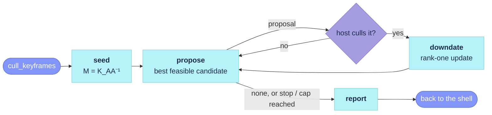

# `src/placecell_gram_greedy.cpp`

## State

`State` belongs to one call, indexed like `scope.alive`; it is built by the seed and discarded when the driver returns.

```cpp
struct State
{
    Eigen::MatrixXd M;                     // K_AA^-1 (jittered); zero row/column once removed
    std::vector<Eigen::VectorXd> W_rows;   // K_HA M, one row per history view (seeded, then one per cull)
    std::vector<double> v_h;               // unexplained information of each history row
    std::vector<char> removed;             // culled in this call
};
```

[`seed`](#seed) builds all four: `M` from the alive block, one `W_rows` entry $\mathbf{w}_h = \mathbf{M}\mathbf{k}_{hA}^{\!\top}$ and one `v_h` per history row in scope, and `removed` all zero. [`downdate`](#downdate) is the only other writer: each accepted cull updates `M` and every `W_rows` / `v_h` entry, appends one entry for the culled view, and sets its `removed` flag. The row and column of a removed view in `M` are exactly zero, not just zero up to rounding.

`Proposal` is what [`propose`](#propose) returns:

```cpp
struct Proposal
{
    int index;                    // position in scope.alive, -1 = no feasible candidate
    double unique_information;    // v_i = 1/M_ii
    double worst_after;           // max unexplained view right after the cull
    double score;                 // the value of scope.objective that won (v_i, worst_after or the total loss)
};
```

[`cull`](#cull) uses `index` for the stop test, the executor, a refusal and the report id, and copies `unique_information` and `worst_after` into the `CulledView` (`worst_after` becomes `worst_unexplained_after`). [`downdate`](#downdate) reads `index` and takes `unique_information` as the culled view's $v_h$. `score` never leaves `propose`: it only serves the comparison with the running best.

## Flow


```mermaid
%%{init: {"themeVariables": {"fontSize": "19px"}, "flowchart": {"nodeSpacing": 25, "rankSpacing": 30}}}%%
flowchart LR
    SHELL([cull_keyframes]) --> SEED["<b>seed</b><br/>M = K_AA⁻¹"]
    SEED --> PROP["<b>propose</b><br/>best feasible candidate"]
    PROP -- proposal --> EXEC{host culls it?}
    EXEC -- yes --> DOWN["<b>downdate</b><br/>rank-one update"] --> PROP
    EXEC -- no --> PROP
    PROP -- "none, or stop / cap reached" --> REP["<b>report</b>"]
    REP --> OUT([back to the shell])

    click SEED "#seed"
    click PROP "#propose"
    click DOWN "#downdate"
    click REP "#report"

    %% VSLAM-LAB logo squares: cyan #b5f3f9, periwinkle #8195fb, lavender #a59ddf
    classDef entry fill:#8195fb,stroke:#5f74d6,color:#fff
    classDef step fill:#b5f3f9,stroke:#7fcfd8,color:#1b2a4a
    classDef check fill:#a59ddf,stroke:#7e75c4,color:#1b2a4a

    class SHELL,OUT entry
    class SEED,PROP,DOWN,REP step
    class EXEC check
```

## Driver

### `cull`

```cpp
void cull(const CullScope& scope, CullExecutor& execute, PlaceCell::CullReport& report, Profiler& profiler)
```

Runs one gram-greedy call. It seeds the linear-algebra state once, then culls one view at a time, always the feasible candidate that minimises `scope.objective`, and stops when no candidate is feasible, when `scope.stop_at` views are alive in scope, or when `scope.max_per_call` culls were accepted. Finally it fills the report.

Each iteration asks [`propose`](#propose) for a candidate and hands it to the host through the executor. An accepted cull appends a `CullReport::CulledView` (`id`, `unique_information` $= v_i$, `worst_unexplained_after` from the proposal's `worst_after`, `alive_after`) and runs [`downdate`](#downdate). A refused cull (e.g. a deferred erase) leaves the state untouched: the view stays alive and keeps explaining the others, but it is cleared in the driver's copy of the candidates, so it is not proposed again in this call. A refusal counts towards neither `max_per_call` nor the alive count; since each one removes a candidate, the loop still ends. The next call starts again from the shell's candidates.

`max_per_call` exists for online threshold changes: raising tau makes many views feasible at once, and the cap spreads their culls over successive calls. After the loop, [`report`](#report) fills the rest of the report from the final state.

`scope` is the shell's snapshot (kernel, alive and history rows, candidates, budget, objective). `execute` runs a cull on the host and marks the row culled on acceptance. `report` arrives with `views_total` and `candidates` set by the shell; `cull` appends to `report.culled` and fills the rest through [`report`](#report). `profiler` is the store's; `cull` records `cull_keyframes/inverse` (the seed, size $|A|$) and `cull_keyframes/greedy` (the loop and the report minus the executor's time, sizes $|A|$ and the history count at the end of the call).

!!! note
    The executor calls the host's callback with `mutex_` not held (the shell never holds it here; the host typically takes its own map lock in the callback). On acceptance it calls the mark-culled function the shell gave it, which sets the row's culled flag under `mutex_`. That is the only way a cull reaches the store.

!!! warning
    When the history in scope is empty, the kernel is centred and the scope is the whole map, the centring set equals the alive set: $\mathbf{K}_{AA}$ is rank-deficient and every $v_i$ of the call is jitter-scale (issue #5). `cull` logs this once per process, after the seed and before the loop.

**Cost** O(|A|³ + |H| |A|²) for the seed, then per iteration one propose (O(|A| |H|), plus O(|A|²) for `total-loss`), per accepted cull one downdate (O(|H| |A| + |A|²)), then one report (O(|H| + |A|)); $|H|$ grows by one per accepted cull. Timed as `cull_keyframes/inverse` (seed) and `cull_keyframes/greedy` (the rest, minus the executor's time, which the shell records as `cull_keyframes/host_callback`)

## Steps

### `seed`

```cpp
State seed(const CullScope& scope)
```

Builds the state a gram-greedy call starts from: the inverse of the alive block of the kernel and, for every history row in scope, its explanation weights and its unexplained information. It is the only step of a call that is not incremental.

$$
\mathbf{M} = (\mathbf{K}_{AA} + \varepsilon \mathbf{I})^{-1}, \qquad \mathbf{w}_h = \mathbf{M}\,\mathbf{k}_{hA}^{\!\top}, \qquad v_h = K_{hh} - \mathbf{w}_h \cdot \mathbf{k}_{hA} \quad \forall h \in H
$$

$\mathbf{K}_{AA}$ is the alive block of the kernel (`scope.similarity`, raw or centred): the rows and columns indexed by `scope.alive`. The jitter $\varepsilon$ = `jitter` is added to its diagonal while it is copied. A centred kernel has rank $m-1$ over its $m$ usable views, so its alive block is singular or close to it, and near-duplicate views make a raw one badly conditioned; the jitter makes $\mathbf{K}_{AA}$ positive definite for any PSD kernel, at the cost of a bias of order $\varepsilon$ in every score. $\mathbf{M}$ comes from an LDLT factorisation solved against the identity.

The rows $\mathbf{w}_h$ form $\mathbf{W} = \mathbf{K}_{HA}\mathbf{M}$ (paper eq. `downdate_W`), one per history view, computed as $\mathbf{M}\mathbf{k}_{hA}^{\!\top}$ since $\mathbf{M}$ is symmetric. $v_h$ is paper eq. `unexplained` with $x = h$, clamped at $0$ against rounding. The history rows are seeded in count-driven mode too: the price test cannot fail there, but $v_h$ still feeds `worst_after` in [`propose`](#propose), hence the `minimax` score and `CulledView::worst_unexplained_after`, and `worst_history` in the report.

`scope` is the shell's snapshot; `seed` reads its kernel, its alive rows and its history rows.

Returns the `State`: `M` as above, `W_rows` and `v_h` with one entry per history row in `scope.history` order, and `removed` with one zero flag per alive position.

!!! warning
    The LDLT pivots are not checked. An indefinite kernel (an unclipped `set_kernel` matrix) can leave non-positive $M_{ii}$, which [`propose`](#propose) then skips without a word (issue #3).

!!! note
    $K_{hh}$ and $\mathbf{k}_{hA}$ carry no jitter while $\mathbf{M}$ does, so a seeded $v_h$ sits $\varepsilon$ below the Schur identity $1/M_{ii}$ that [`downdate`](#downdate) assigns to views culled in the same call (exactly $\varepsilon$ in exact arithmetic, when the kernel and the scope are unchanged). Harmless at $10^{-6}$.

**Cost** O(|A|³) for the inverse + O(|H| |A|²) for the history rows; space O(|A|² + |H| |A|). Timed as `cull_keyframes/inverse`

### `propose`

```cpp
Proposal propose(const CullScope& scope, const State& state, const std::vector<char>& candidate)
```

Picks the next view to cull. A candidate is feasible when removing it keeps every view within budget: its own unique information, and the unexplained information of every history row after the cull. Among the feasible candidates, `propose` returns the one with the smallest `scope.objective` score.

$$
v_i = \frac{1}{M_{ii}} \le \tau, \qquad
\frac{W_{hi}^2}{M_{ii}} \le \begin{cases} \tau - v_h, & v_h \le \tau \\ \delta, & v_h > \tau \end{cases}
\quad \forall h \in H
$$

The price $W_{hi}^2/M_{ii}$ is exactly the rise of $v_h$ that [`downdate`](#downdate) would apply (paper eq. `price`), so the test is exact. A row within budget is never raised past $\tau$. A row already above it (tau was lowered between calls) may deteriorate by at most $\delta$ = `over_budget_slack` per cull, so it vetoes only the candidates that really explain it. The paper's eq. `greedy_rule` uses the same split bound.

The score depends on `scope.objective`:

| Objective | Score |
|---|---|
| `unique` (default) | $v_i$ |
| `minimax` | the worst unexplained view right after the cull, $\max\big(v_i, \max_h (v_h + W_{hi}^2/M_{ii})\big)$ |
| `total-loss` | $v_i + \sum_h W_{hi}^2/M_{ii} + \sum_{j} \big(1/(M_{jj} - M_{ji}^2/M_{ii}) - 1/M_{jj}\big)$ over the other alive $j$ |

Ties go to the smaller $v_i$, then to the lowest kernel row (insertion order). In count-driven mode ($\tau = +\infty$) both tests pass and the result is a plain argmin of the score. Why there are three objectives, what separates them and which to use: [`2026-09-29_cull_objectives.md`](../notes/2026-09-29_cull_objectives.md).

`scope` is the shell's snapshot. `state` holds the current inverse `M`, the history rows `W_rows` and `v_h`, and the `removed` flags. `candidate` has one flag per alive position: the driver's copy of `scope.candidate`, with refused views cleared.

Returns a `Proposal`: `index` is the position in `scope.alive`, or −1 when no candidate is feasible; `unique_information` is $v_i$; `worst_after` is the worst unexplained view right after the cull; `score` is the objective value that won.

!!! warning
    A candidate with $M_{ii} \le 0$ (an indefinite kernel, issue #3, or rounding drift) is skipped without a word: its $v_i$ would be negative and win the argmin. A feasible `total-loss` candidate whose downdate leaves some pivot $\le 0$ scores $+\infty$, but it still beats the initial empty proposal, so it is returned when no candidate has a finite score.

**Implementation.** One scan over the alive positions. With `unique`, a candidate whose $v_i$ is at or above the running best is skipped before the history scan, since it cannot win. The history scan of a candidate stops at its first veto, and accumulates the worst view and the summed prices on the way. `total-loss` then adds the rise of each other alive view, read off the diagonal of the downdated $\mathbf{M}$ (paper eq. `downdate_M`), without forming it.

**Cost** O(|A| |H|), plus O(|A|²) for `total-loss`; space O(1). Once per loop iteration, inside `cull_keyframes/greedy`

### `downdate`

```cpp
void downdate(const CullScope& scope, State& state, const Proposal& proposal)
```

Applies an accepted cull of alive position $i$ = `proposal.index` to the state: it removes the view from the alive block of $\mathbf{M}$, raises every history row by its price, and appends the culled view to the history. No solve is repeated; everything is a rank-one update.

$$
v_h \mathrel{+}= \frac{W_{hi}^2}{M_{ii}}, \qquad
\mathbf{w}_h \mathrel{-}= \frac{W_{hi}}{M_{ii}}\,\mathbf{m}, \qquad
\mathbf{M} \mathrel{-}= \frac{\mathbf{m}\mathbf{m}^{\!\top}}{M_{ii}}, \qquad \mathbf{m} = \mathbf{M}_{:,i}
$$

These are paper eqs. `price`, `downdate_W` and `downdate_M`, applied in that order with $M_{ii}$ and $\mathbf{m}$ taken before anything changes. The price is the one [`propose`](#propose) tested. The update of $\mathbf{M}$ is the Schur downdate that leaves the inverse of the alive block without $i$ on the other positions; it also zeroes row and column $i$ in exact arithmetic, and the code sets them to exactly $0$ afterwards to remove the rounding residue. Then `state.removed[i] = 1`.

The culled view joins the history. Its row is $\mathbf{w}_i = \mathbf{M}\mathbf{k}_{iA}^{\!\top}$ against the updated $\mathbf{M}$, with $\mathbf{k}_{iA}$ read over every alive position; its own column and the removed ones contribute nothing because they are exactly zero in $\mathbf{M}$. Its $v_h$ is `proposal.unique_information` $= 1/M_{ii}$, by the Schur identity, with no fresh solve.

`scope` supplies the kernel for the new history row. `state` is updated in place. `proposal` is the accepted proposal from [`propose`](#propose); the state has not changed since it was computed, because a refusal never touches it.

!!! note
    Entry $i$ of each existing $\mathbf{w}_h$ is $0$ in exact arithmetic but keeps rounding dust, which is never read again: [`propose`](#propose) skips removed positions, and a later downdate reads only its own column. Nothing in a call re-factorises $\mathbf{M}$, so rounding accumulates over the culls of one call.

!!! note
    $1/M_{ii}$ is the unexplained information under the jittered kernel, so the culled view's $v_h$ sits $\varepsilon$ above the $K_{hh} - \mathbf{w}_h \cdot \mathbf{k}_{hA}$ that [`seed`](#seed) computes for the same view in the next call (exactly $\varepsilon$ in exact arithmetic, when the kernel and the scope are unchanged).

**Cost** O(|H| |A|) for the history rows + O(|A|²) for $\mathbf{M}$ and the new row; space O(|A|). Once per accepted cull, inside `cull_keyframes/greedy`

### `report`

```cpp
void report(const CullScope& scope, const State& state, PlaceCell::CullReport& report)
```

Fills the report from the state the loop ended with: the alive count, the history against tau, whether the cap was hit, and the unique information of every view that stays alive. It is output only: nothing here feeds a culling decision. The fields go to the Recorder and the log through `on_cull_call`, to the viz alive strip, and to the host.

The counts come from the report itself: `report.culled` holds one `CulledView` per accepted cull (the shell never appends to it), so the number culled is its size and the alive count is $|A|$ minus that.

| Field | Value |
|---|---|
| `alive_after` | the alive count in scope after the call |
| `worst_history` | the largest $v_h$ over every history row, including the views culled in this call; $0$ with no history |
| `history_over_budget` | the rows with $v_h > \tau$; always $0$ in count-driven mode |
| `reached_max_per_call` | `max_per_call > 0` and that many culls were accepted; set whenever the cap was hit, even if the loop would have stopped there anyway |
| `alive_ids`, `alive_unique_information` | every alive position not removed, in `scope.alive` order, with $1/M_{ii}$, or NaN where $M_{ii} \le 0$ |

`scope` supplies the ids, tau and the cap. `state` is the final state of the call. `report` must already hold every accepted cull in `culled`.

!!! note
    `alive_unique_information` holds the scores at the end of this call. The next call re-seeds from a fresh snapshot, so its scores differ once the kernel, the scope or the centring set changed.

**Cost** O(|H| + |A|); space O(|A|) for the two alive vectors. Once per call, inside `cull_keyframes/greedy`
