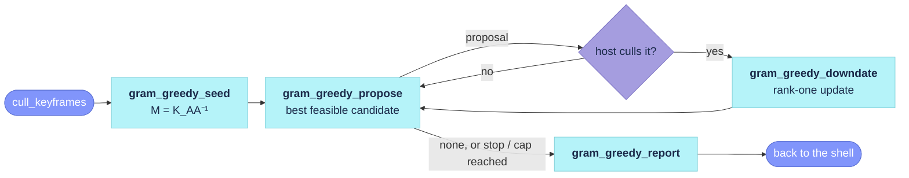

# `src/placecell_gram_greedy.cpp`

The gram-greedy culling method. The shell, [`cull_keyframes`](https://github.com/alejandrofontan/placecell/blob/main/src/placecell_cull.cpp#L191 "case CullMethod::gram_greedy:"),
builds a `CullScope` (the kernel snapshot, the alive and history rows in scope, the candidates,
tau, the stop count, the cap and the objective) and a `CullExecutor`, and hands both to
[`cull_gram_greedy`](#cull_gram_greedy). The driver seeds the linear-algebra state once, then
culls one view at a time: [`gram_greedy_propose`](#gram_greedy_propose) picks the feasible
candidate, the executor asks the host to erase it, and [`gram_greedy_downdate`](#gram_greedy_downdate)
applies an accepted cull by rank-one updates, so the only O(|A|³) step of a call is the seed's
inverse. [`gram_greedy_report`](#gram_greedy_report) fills the report from the final state. The
four steps are static and touch neither the store nor the lock; only the executor does. The
source carries no comments, so this page is the description of the file; the derivation is
`paper/sec/03_methodology.tex` (§ Unexplained information, § Greedy joint-information culling).

Sources: `src/placecell_gram_greedy.cpp`, the declarations, `GramGreedyState`, `GramGreedyProposal`,
`CullExecutor` and the two constants in the private section of `include/placecell/placecell.h`;
the shell is on [`placecell.md`](placecell.md). Reading notes:
[`docs/review/placecell_gram_greedy.md`](../review/placecell_gram_greedy.md).

## State

`GramGreedyState` belongs to one call, indexed like `scope.alive`; it is built by the seed and
discarded when the driver returns.

| Member | Holds | Written by |
|---|---|---|
| `M` | $\mathbf{K}_{AA}^{-1}$ over `scope.alive`, jittered; the row and column of a view culled in this call are exactly zero | [`gram_greedy_seed`](#gram_greedy_seed), [`gram_greedy_downdate`](#gram_greedy_downdate) |
| `W_rows` | one vector per history row, $\mathbf{w}_h = \mathbf{M}\mathbf{k}_{hA}^{\!\top}$ over the alive positions | seed (the history in scope), downdate (every row updated, one appended per accepted cull) |
| `v_h` | the unexplained information of each history row, same order as `W_rows` | seed, downdate |
| `removed` | one flag per alive position, set for the views culled in this call | seed (all zero), downdate |

`GramGreedyProposal` is what [`gram_greedy_propose`](#gram_greedy_propose) returns:

| Field | Holds | Read by |
|---|---|---|
| `index` | position in `scope.alive`, −1 = no feasible candidate | driver (stop test, executor, refusal, report id), downdate |
| `unique_information` | $v_i = 1/M_{ii}$ | driver (refusal DEBUG line, `CulledView`), downdate (the culled view's $v_h$) |
| `worst_after` | the largest unexplained view right after the cull | driver (`CulledView`) |
| `score` | the value of `scope.objective` that won | propose only (comparison with the running best) |

## Call graph

- **[`cull_gram_greedy`](https://github.com/alejandrofontan/placecell/blob/main/src/placecell_gram_greedy.cpp#L147)** → [`gram_greedy_seed`](https://github.com/alejandrofontan/placecell/blob/main/src/placecell_gram_greedy.cpp#L23); per iteration [`gram_greedy_propose`](https://github.com/alejandrofontan/placecell/blob/main/src/placecell_gram_greedy.cpp#L49), [`CullExecutor::operator()`](https://github.com/alejandrofontan/placecell/blob/main/include/placecell/placecell.h#L460 "bool operator()(const int row)"), [`gram_greedy_downdate`](https://github.com/alejandrofontan/placecell/blob/main/src/placecell_gram_greedy.cpp#L96); after the loop [`gram_greedy_report`](https://github.com/alejandrofontan/placecell/blob/main/src/placecell_gram_greedy.cpp#L120)
- called from the shell's switch in [`cull_keyframes`](https://github.com/alejandrofontan/placecell/blob/main/src/placecell_cull.cpp#L191 "case CullMethod::gram_greedy:")

## Flow


```mermaid
%%{init: {"themeVariables": {"fontSize": "19px"}, "flowchart": {"nodeSpacing": 25, "rankSpacing": 30}}}%%
flowchart LR
    SHELL([cull_keyframes]) --> SEED["<b>gram_greedy_seed</b><br/>M = K_AA⁻¹"]
    SEED --> PROP["<b>gram_greedy_propose</b><br/>best feasible candidate"]
    PROP -- proposal --> EXEC{host culls it?}
    EXEC -- yes --> DOWN["<b>gram_greedy_downdate</b><br/>rank-one update"] --> PROP
    EXEC -- no --> PROP
    PROP -- "none, or stop / cap reached" --> REP["<b>gram_greedy_report</b>"]
    REP --> OUT([back to the shell])

    click SEED "#gram_greedy_seed"
    click PROP "#gram_greedy_propose"
    click DOWN "#gram_greedy_downdate"
    click REP "#gram_greedy_report"

    %% VSLAM-LAB logo squares: cyan #b5f3f9, periwinkle #8195fb, lavender #a59ddf
    classDef entry fill:#8195fb,stroke:#5f74d6,color:#fff
    classDef step fill:#b5f3f9,stroke:#7fcfd8,color:#1b2a4a
    classDef check fill:#a59ddf,stroke:#7e75c4,color:#1b2a4a

    class SHELL,OUT entry
    class SEED,PROP,DOWN,REP step
    class EXEC check
```

## Driver

### `cull_gram_greedy`

```cpp
void PlaceCell::cull_gram_greedy(const CullScope& scope, CullExecutor& execute, CullReport& report)
```
Runs one gram-greedy call: seeds the state, then culls one view at a time, the feasible candidate that minimises `scope.objective`, until none is feasible, `scope.stop_at` views are alive in scope or `scope.max_per_call` culls were accepted, and fills the report.

- **Mechanism**:
  - copies `scope.candidate`, so a refusal can take a view out of the running for this call only
  - [`gram_greedy_seed`](#gram_greedy_seed) builds the state; its time is recorded as `cull_keyframes/inverse` with size $|A|$
  - WARN once, after the seed and before the loop, when the history in scope is empty, the kernel is centred and the scope is the whole map: the centring set then equals the alive set, $\mathbf{K}_{AA}$ is rank-deficient and every $v_i$ of the call is jitter-scale (issue #5)
  - the loop runs while more than `scope.stop_at` views are alive in scope and, when `max_per_call > 0`, fewer than that many culls were accepted; each iteration asks [`gram_greedy_propose`](#gram_greedy_propose) for a candidate and stops on index −1
  - the proposal goes to the host through the executor, which calls the host's callback with `mutex_` released (the host typically takes its own map lock there) and, on acceptance, marks the row culled under `mutex_`
  - a refusal (e.g. a deferred erase) is logged at DEBUG with the view's id and $v_i$ and clears the view in the call's copy of the candidates; the state is untouched, the view stays alive and keeps explaining the others, and the loop asks again. A refusal counts towards neither `max_per_call` nor the alive count, and each one removes a candidate, so the loop ends; the next call starts again from the shell's candidates
  - an accepted cull decrements the alive count, appends a `CullReport::CulledView` (id, $v_i$, `worst_after`, alive count after the cull) and then runs [`gram_greedy_downdate`](#gram_greedy_downdate)
  - `max_per_call` exists for online threshold changes: raising tau makes many views feasible at once, and the cap spreads their culls over successive calls
  - after the loop, [`gram_greedy_report`](#gram_greedy_report) fills the rest of the report from the final state
- **Reads**: `scope.row_ids`, `scope.alive`, `scope.candidate` (copied), `scope.history`, `scope.stop_at`, `scope.max_per_call`, `scope.centred`, `scope.local`, and the rest of `scope` through the four steps
- **Writes**: `report.culled`, the rest of the report through [`gram_greedy_report`](#gram_greedy_report) (`views_total` and `candidates` were set by the shell); the store only through the executor; the `cull_keyframes/inverse` and `cull_keyframes/greedy` profiler rows
- **Lock**: none held; the executor takes `mutex_` briefly to mark a view culled, after the host callback has returned
- **Cost**: time O(|A|³ + |H| |A|²) for the seed, then per iteration one propose (O(|A| |H|), plus O(|A|²) for `total-loss`) and per accepted cull one downdate (O(|H| |A| + |A|²)), then one report (O(|H| + |A|)); $|H|$ grows by one per accepted cull. `cull_keyframes/greedy` records the loop and the report minus the executor's time (the shell records that as `cull_keyframes/host_callback`), with sizes $|A|$ and the history count at the end of the call
- **Called from**: [`cull_keyframes`](https://github.com/alejandrofontan/placecell/blob/main/src/placecell_cull.cpp#L191 "case CullMethod::gram_greedy:"), the only `case` of its switch

## Steps

### `gram_greedy_seed`

```cpp
PlaceCell::GramGreedyState PlaceCell::gram_greedy_seed(const CullScope& scope)
```
Builds the state a gram-greedy call starts from: the inverse of the alive block of the kernel and, for every history row in scope, its explanation weights and its unexplained information.

- **Mechanism**:
  - $\mathbf{K}_{AA}$ is the alive block of the kernel $\mathbf{K}$ (`scope.similarity`, raw or centred): the rows and columns indexed by `scope.alive`
  - $\varepsilon$ = `gram_greedy_jitter` is added to the diagonal of $\mathbf{K}_{AA}$ while it is copied: a centred kernel has rank $m-1$ over its $m$ usable views and near-duplicate views make a raw one nearly singular, so without it the factorisation is not positive definite; the cost is a bias of order $\varepsilon$ in every score
  - $\mathbf{M} = \mathbf{K}_{AA}^{-1}$, by an LDLT factorisation solved against the identity; the pivots are not checked, so an indefinite kernel leaves non-positive $M_{ii}$ that [`gram_greedy_propose`](#gram_greedy_propose) skips (issue #3)
  - `state.W_rows`: one row per history view $h$ in `scope.history`, $\mathbf{W} = \mathbf{K}_{HA}\mathbf{M}$ (paper eq. `downdate_W`), computed per row as $\mathbf{w}_h = \mathbf{M}\mathbf{k}_{hA}^{\!\top}$ since $\mathbf{M}$ is symmetric
  - `state.v_h`: the unexplained information of each history view, $v_h = K_{hh} - \mathbf{w}_h \cdot \mathbf{k}_{hA}$ (paper eq. `unexplained` with $x = h$), clamped at $0$ against rounding; $K_{hh}$ and $\mathbf{k}_{hA}$ carry no jitter, so it differs by a gap of order $\varepsilon$ from the identity $1/M_{ii}$ that [`gram_greedy_downdate`](#gram_greedy_downdate) uses for views culled in the same call
  - the history rows are seeded in count-driven mode too, where the price test cannot fail and their only consumer is `worst_history`
  - `state.removed`: one flag per alive position, all zero
- **Reads**: `scope.similarity`, `scope.alive`, `scope.history`; the constant `gram_greedy_jitter`
- **Writes**: none on the store; returns the `GramGreedyState` (`M`, `W_rows`, `v_h`, `removed`)
- **Lock**: none; static, `scope` is the shell's snapshot
- **Cost**: time O(|A|³) for the inverse + O(|H| |A|²) for the history rows, space O(|A|² + |H| |A|)
- **Called from**: [`cull_gram_greedy`](#cull_gram_greedy), once per call, timed as `cull_keyframes/inverse`

### `gram_greedy_propose`

```cpp
PlaceCell::GramGreedyProposal PlaceCell::gram_greedy_propose(const CullScope& scope, const GramGreedyState& state,
                                                             const std::vector<char>& candidate)
```
Picks the next view to cull: among the alive candidates whose removal keeps every view within budget, the one that minimises `scope.objective`; index −1 when none is feasible.

- **Mechanism**:
  - scans the alive positions $i$ in order, skipping those already removed in this call, those cleared in `candidate` and those with $M_{ii} \le 0$ (a non-positive pivot, e.g. an indefinite kernel or rounding drift, drops the view without a word; it would otherwise give a negative $v_i$ that wins the argmin)
  - $v_i = 1/M_{ii}$ is the unique information of the candidate (paper eq. `unique_information`); it is infeasible when $v_i > \tau$
  - with `unique`, a candidate with $v_i$ at or above the running best is skipped before the history scan, since it cannot win
  - for every history row $h$, the price $W_{hi}^2 / M_{ii}$ is the rise of $v_h$ that [`gram_greedy_downdate`](#gram_greedy_downdate) would apply (paper eq. `price`); it may not exceed $\tau - v_h$ for a row within budget, or $\delta$ = `gram_greedy_over_budget_slack` for a row already above $\tau$ (tau lowered between calls). A row within budget is therefore never raised past $\tau$, and a row over budget vetoes only the candidates that explain it, instead of every candidate. The history scan of a candidate stops at its first veto. The paper's eq. `greedy_rule` still writes the bound as $\max(\tau - v_h, \delta)$, which differs for a row within $\delta$ of $\tau$
  - `worst_after` $= \max\big(v_i, \max_h (v_h + W_{hi}^2/M_{ii})\big)$, the largest unexplained view right after the cull, exact from the pre-cull state by the identity the downdate applies
  - the score of a feasible candidate depends on `scope.objective`: `unique` (default) is $v_i$; `minimax` is `worst_after`; `total-loss` is $v_i + \sum_h W_{hi}^2/M_{ii} + \sum_{j} \big(1/(M_{jj} - M_{ji}^2/M_{ii}) - 1/M_{jj}\big)$ over the other alive $j$ with $M_{jj} > 0$, the rise of each unique information read off the diagonal of the downdated $\mathbf{M}$ (paper eq. `downdate_M`); a downdated pivot $\le 0$ makes the loss $+\infty$. The first two terms are information lost by views that leave the alive set, the third a rise in the unique information of views that stay. The feasibility test is the same for all three objectives; the paper describes only `unique`
  - a candidate replaces the running best on a strictly smaller score, or an equal score with a smaller $v_i$; remaining ties go to the lowest kernel row (insertion order). The running best starts at score $+\infty$, so a feasible candidate with an infinite total loss is still returned when no finite one exists
  - count-driven mode ($\tau = +\infty$): neither test can fail, the result is a plain argmin of the objective
- **Reads**: `scope.alive`, `scope.tau`, `scope.objective`; `state.M`, `state.W_rows`, `state.v_h`, `state.removed`; `candidate` (the driver's copy of `scope.candidate`, with refused views cleared); the constant `gram_greedy_over_budget_slack`
- **Writes**: none; returns the `GramGreedyProposal` (`index`, `unique_information` $= v_i$, `worst_after`, `score`)
- **Lock**: none; static, read-only on `scope` and `state`
- **Cost**: time O(|A| |H|) for `unique` and `minimax`, plus O(|A|²) for `total-loss`; space O(1)
- **Called from**: [`cull_gram_greedy`](#cull_gram_greedy), once per loop iteration, inside the `cull_keyframes/greedy` row

### `gram_greedy_downdate`

```cpp
void PlaceCell::gram_greedy_downdate(const CullScope& scope, GramGreedyState& state,
                                     const GramGreedyProposal& proposal)
```
Applies an accepted cull to the state: removes the view from the alive block of $\mathbf{M}$, raises every history row by its price, and appends the culled view to the history.

- **Mechanism**:
  - $i$ = `proposal.index`; $M_{ii}$ and $\mathbf{m} = \mathbf{M}_{:,i}$ are taken before anything changes, since every update below reads them
  - for every history row $h$: $v_h \mathrel{+}= W_{hi}^2 / M_{ii}$ (paper eq. `price`), the price [`gram_greedy_propose`](#gram_greedy_propose) tested, and $\mathbf{w}_h \mathrel{-}= (W_{hi}/M_{ii})\,\mathbf{m}$, the rank-one downdate of $\mathbf{W}$ (paper eq. `downdate_W`); entry $i$ of $\mathbf{w}_h$ is $0$ in exact arithmetic but keeps rounding dust, which is never read again (propose skips removed positions, a later downdate reads only its own column)
  - $\mathbf{M} \mathrel{-}= \mathbf{m}\mathbf{m}^{\!\top} / M_{ii}$ (paper eq. `downdate_M`), the rank-one Schur downdate that leaves the inverse of the alive block without $i$ on the other positions; it also zeroes row and column $i$ in exact arithmetic, and the explicit `setZero` of both removes the rounding residue so they are exactly $0$, which the new history row below relies on
  - `state.removed[i] = 1`
  - the culled view joins the history: its row $\mathbf{w}_i = \mathbf{M}\mathbf{k}_{iA}^{\!\top}$ against the updated $\mathbf{M}$ ($\mathbf{M}$ symmetric), with $\mathbf{k}_{iA}$ read over every alive position; its own and the removed columns contribute nothing because their columns of $\mathbf{M}$ are zero
  - its $v_h$ is `proposal.unique_information` $= 1/M_{ii}$ (the Schur identity), no fresh solve; $1/M_{ii}$ is the unexplained information under the jittered kernel, so it sits a gap of order $\varepsilon$ above the $K_{hh} - \mathbf{w}_h \cdot \mathbf{k}_{hA}$ that [`gram_greedy_seed`](#gram_greedy_seed) would compute for the same view in the next call
  - exact in arithmetic; nothing in a call re-factorises $\mathbf{M}$, so rounding accumulates over the culls of one call
- **Reads**: `proposal.index`, `proposal.unique_information`; `scope.similarity`, `scope.alive`; `state.M`, `state.W_rows`, `state.v_h`
- **Writes**: `state.M`, `state.W_rows` (every row updated, one appended), `state.v_h` (every entry raised, one appended), `state.removed`; nothing on the store (the executor already marked the view culled)
- **Lock**: none; static, `scope` is the shell's snapshot and `state` belongs to the call
- **Cost**: time O(|H| |A|) for the history rows + O(|A|²) for $\mathbf{M}$ and the new row; space O(|A|) for $\mathbf{m}$, $\mathbf{k}$ and the new row
- **Called from**: [`cull_gram_greedy`](#cull_gram_greedy), once per accepted cull, inside the `cull_keyframes/greedy` row

### `gram_greedy_report`

```cpp
void PlaceCell::gram_greedy_report(const CullScope& scope, const GramGreedyState& state, CullReport& report)
```
Fills the report from the state the loop ended with: the alive count, the history against tau, whether the cap was hit, and the unique information of every view that stays alive.

- **Mechanism**:
  - the counts come from the report itself: `report.culled` holds one `CulledView` per accepted cull (the shell never appends to it), so the number culled is its size and the alive count is $|A|$ minus that
  - `alive_after`: the alive count in scope after the call
  - `worst_history`: the largest $v_h$ over every history row, including the views culled in this call ($0$ with no history)
  - `history_over_budget`: the rows with $v_h > \tau$ (always $0$ in count-driven mode)
  - `reached_max_per_call`: `max_per_call > 0` and that many culls were accepted, set whenever the cap was hit, even if the loop would have stopped there anyway
  - `alive_ids` and `alive_unique_information`: every alive position not removed, in `scope.alive` order, with $1/M_{ii}$, or NaN where $M_{ii} \le 0$. These are the scores at the end of this call; the next call re-seeds from a fresh snapshot, so its scores differ once the kernel, the scope or the centring set changed
  - output only: nothing here feeds a culling decision; the fields go to the Recorder and the log through `on_cull_call`, to the viz alive strip, and to the host
- **Reads**: `scope.row_ids`, `scope.alive`, `scope.tau`, `scope.max_per_call`; `state.v_h`, `state.M`, `state.removed`; `report.culled`
- **Writes**: `report.alive_after`, `worst_history`, `history_over_budget`, `reached_max_per_call`, `alive_ids`, `alive_unique_information`; nothing on the store or the state
- **Lock**: none; static, `scope` is the shell's snapshot and `state` belongs to the call
- **Cost**: time O(|H| + |A|), space O(|A|) for the two alive vectors
- **Called from**: [`cull_gram_greedy`](#cull_gram_greedy), once per call after the loop, inside the `cull_keyframes/greedy` row

## Parameters read by this file

Everything comes through `CullScope`, filled by the shell from `CullParameters` and the store,
plus two class constants in `include/placecell/placecell.h`.

| Source | Field | Value | Used in | Effect |
|---|---|---|---|---|
| `CullScope` | `similarity` | the kernel snapshot, raw or centred | [`gram_greedy_seed`](#gram_greedy_seed), [`gram_greedy_downdate`](#gram_greedy_downdate) | the matrix marginalised |
| `CullScope` | `row_ids` | the external id of every kernel row | [`cull_gram_greedy`](#cull_gram_greedy), [`gram_greedy_report`](#gram_greedy_report) | ids for the DEBUG line, `CulledView` and `alive_ids` |
| `CullScope` | `alive`, `history` | usable rows in scope, split by the culled flag | seed, downdate, driver, report | the columns of `M` / `W` and the rows of `W` |
| `CullScope` | `candidate` | alive positions that are not protected | [`gram_greedy_propose`](#gram_greedy_propose) (through the driver's copy) | which views may be proposed |
| `CullScope` | `tau` | `max_unexplained`, or +inf in count-driven mode | propose, report | the budget of every view; `history_over_budget` counts rows above it |
| `CullScope` | `stop_at` | `min_keyframes`, or `max(min_keyframes, target_alive)` | driver | the loop stops at this many alive views in scope |
| `CullScope` | `max_per_call` | `CullParameters::max_per_call` | driver, report | cap on accepted culls (0 = unlimited) |
| `CullScope` | `objective` | `CullParameters::objective` parsed to `CullObjective` (`unique`) | [`gram_greedy_propose`](#gram_greedy_propose) | what the feasible candidates are ranked by: `v_i`, the worst view after the cull, or the total loss |
| `CullScope` | `centred`, `local` | `CullParameters::centred`, window given | driver | the issue-#5 warning fires only when centred, map scope, no history |
| constant | [`gram_greedy_jitter`](https://github.com/alejandrofontan/placecell/blob/main/include/placecell/placecell.h#L501) | `1e-6` | seed | added to the diagonal of `K_AA`; the query's `solve_information` uses the same value as a separate literal (issue #6) |
| constant | [`gram_greedy_over_budget_slack`](https://github.com/alejandrofontan/placecell/blob/main/include/placecell/placecell.h#L502) | `0.01` | propose | the most a history row already above tau may deteriorate per cull; rows within budget are bounded by `tau − v_h` instead |
