# Item-backed views

The third way to fill a store (`src/placecell_items.cpp`): each view is the set of opaque item ids it observes, a SLAM keyframe's map-point ids, and the kernel is the cosine of the views' indicator vectors (paper eq. `covisibility_kernel`):

$$
K_{ij} = \frac{|P_i \cap P_j|}{\sqrt{|P_i|\,|P_j|}}
$$

a Gram matrix, so PSD with unit diagonal by construction, exactly 0 for views that share nothing, with no common-mode floor to centre away. Unlike a descriptor, a set may change after insertion, as points are fused, culled and created, so the store keeps integer shared counts that a set update adjusts through an inverted index, and rebuilds the float kernel only when someone reads it. AllFeature-VSLAM's covisibility `KeyframeInformation` fills it; the item query is on [the query page](placecell_query.md#unexplained_information).

```mermaid
---
config:
  htmlLabels: false
  themeCSS: "
    text, tspan { font-family: var(--md-text-font-family), sans-serif; }
    .edgePath .path, .flowchart-link { stroke: var(--md-mermaid-edge-color); }
    .marker, marker path { fill: var(--md-mermaid-edge-color); stroke: var(--md-mermaid-edge-color); }
    .edgeLabel rect, .labelBkg { fill: var(--md-default-bg-color); opacity: 1; }
    .edgeLabel text, .edgeLabel tspan { fill: var(--md-default-fg-color); }"
  themeVariables:
    fontSize: 19px
  flowchart:
    htmlLabels: false
    wrappingWidth: 320
    nodeSpacing: 25
    rankSpacing: 30
    curve: basis
    padding: 14
---
flowchart LR
    HOST([host]) --> SI("`**set_items**
    sorted, unique set`")
    SI --> IDX[("`**item_index_**
    item → views`")]
    IDX --> CNT[("`**item_counts_**
    shared counts`")]
    CNT -. "kernel_dirty_" .-> MAT("`**materialise_kernel_locked**
    on the next read`")
    MAT --> K[("`**kernel_**
    row / total sums`")]

    click SI "#set_items"
    click MAT "#materialise_kernel_locked"

    %% VSLAM-LAB logo squares: cyan #b5f3f9, periwinkle #8195fb, lavender #a59ddf
    classDef entry fill:#8195fb,stroke:#5f74d6,stroke-width:2px,color:#fff
    classDef step fill:#b5f3f9,stroke:#7fcfd8,stroke-width:2px,color:#1b2a4a
    classDef store fill:#fff,stroke:#a59ddf,stroke-width:2px,color:#1b2a4a

    class HOST entry
    class SI,MAT step
    class IDX,CNT,K store
    linkStyle default stroke-width:2px
```



## State

All under the store's `mutex_`. `items_` holds each view's sorted, unique set and `item_norms_` its size $|P_i|$. `item_index_` is the inverted index, item → the views observing it. `item_counts_` is the n×n integer matrix of shared counts, with $|P_i|$ on the diagonal. `kernel_dirty_` says the counts changed since the float kernel was last rebuilt, and `item_mode_` that the store was filled this way. [`clear`](placecell.md#clear) resets them all.

## Functions

### `PlaceCell::set_items` {#set_items data-toc-label="set_items"}

```cpp
PlaceCell::InternalId PlaceCell::set_items(const ExternalId id, std::vector<ItemId> items, const ItemOptions& options)
```

Stores or replaces the set of items a view observes, and returns its internal id. The set is sorted and deduplicated first. The first call on an empty store switches it to item mode. A new id appends a row with zero shared counts, and every alive view becomes its explainer. A known id has its set diffed against the stored one, both ways, and each change flows through the inverted index into the counts: an item shared with view $j$ moves $\mathrm{counts}_{ij}$ and $\mathrm{counts}_{ji}$ by one. An identical set for a known view changes nothing. The float kernel is only marked dirty; [`materialise_kernel_locked`](#materialise_kernel_locked) rebuilds it at the next read, so a burst of refreshes costs one rebuild. The overload without `options` forwards the defaults; `options.normalization` accepts only `cosine`, the field exists so another normalisation can be added without an API change.

An empty set is stored too. The view's row is then NaN (0/0), and the culler and the queries ignore it until a non-empty set replaces it; [`on_set_items`](placecell_events.md#on_set_items) warns once, and logs every call at DEBUG with the item count and the diff.

Called from AllFeature-VSLAM's `KeyframeInformationCovisibility`: once per new keyframe with its observations, and on every refresh with each alive keyframe's current set. It also works from the Python binding.

!!! warning "Refused on another mode"
    On a descriptor-backed or kernel-only store the call logs an ERROR and returns `invalid_id`.

!!! note "A culled view's set is frozen"
    A set for a culled view is ignored (WARN once, its internal id is returned): the culler prices history rows against the kernel they were culled under, so those rows must not move.

!!! info "Cost"
    **Time O(|P| log |P| + Σ posting lengths of the changed items), space O(n) for a new row**, plus the O(n) growth of the count matrix for a new view. All under `mutex_`. Timed as `set_items`, with sizes the stored views and the set's items.

### `PlaceCell::materialise_kernel_locked` {#materialise_kernel_locked data-toc-label="materialise_kernel_locked"}

```cpp
void PlaceCell::materialise_kernel_locked() const
```

Rebuilds the float kernel and its centring sums from the shared counts, in item mode and only when `set_items` left the kernel dirty; otherwise it returns at once. Every kernel reader calls it first: [`kernel`](placecell.md#kernel), [`snapshot`](placecell.md#snapshot) (hence `cull_keyframes`, [`dump`](placecell.md#dump) and the viz) and the item [query](placecell_query.md#compute_unexplained_information).

$$
K_{ij} = \frac{\mathrm{counts}_{ij}}{\sqrt{|P_i|\,|P_j|}}, \qquad K_{ii} = 1, \qquad r_i = \sum_{j : |P_j| > 0} K_{ij}
$$

A view with an empty set gets a NaN row and column, and a NaN row sum; the sums run over the non-empty views only, so [`query_system_locked`](placecell_query.md#query_system_locked) leaves empty views out of the centring means. The kernel members are `mutable`, so a `const` reader can rebuild them. `mutex_` is held by the caller.

!!! info "Cost"
    **Time O(n²), space O(n²)**, once per burst of `set_items` calls.

### `PlaceCell::items` {#items data-toc-label="items"}

```cpp
const std::vector<PlaceCell::ItemId>* PlaceCell::items(const ExternalId id) const
```

A stable pointer to a view's sorted item set: it stays valid until [`clear`](placecell.md#clear) (the sets live in a deque), and the set it points to changes when an alive view is refreshed, but no longer once the view is culled. `nullptr` for an unknown id or a store that is not item-backed.

!!! info "Cost"
    **Time O(1), space O(1)**

### `PlaceCell::item_mode` {#item_mode data-toc-label="item_mode"}

```cpp
bool PlaceCell::item_mode() const
```

True once `set_items` has initialised this store, until [`clear`](placecell.md#clear).

!!! info "Cost"
    **Time O(1), space O(1)**
