# The insertion query

How much of a view that is not stored the alive views cannot explain (`src/placecell_query.cpp`): the information a keyframe made from it would add, which the host compares with its insertion threshold. It is the culler's dual, read-only and on the same kernel, for a view given by a descriptor or by its item set:

$$
v_x = K_{xx} - \mathbf{k}_{xA}\,\mathbf{K}_{AA}^{-1}\,\mathbf{k}_{Ax} \in [0, 1]
$$

with $A$ the alive views (or the alive views in the host's window), 1 when nothing alive resembles the view and 0 when the alive views explain it completely (paper eq. `unexplained`, § Keyframe insertion).

```mermaid
---
config:
  htmlLabels: false
  themeCSS: "
    text, tspan { font-family: var(--md-text-font-family), sans-serif; }
    .edgePath .path, .flowchart-link { stroke: var(--md-mermaid-edge-color); }
    .marker, marker path { fill: var(--md-mermaid-edge-color); stroke: var(--md-mermaid-edge-color); }
    .edgeLabel rect, .labelBkg { fill: var(--md-default-bg-color); opacity: 1; }
    .edgeLabel text, .edgeLabel tspan { fill: var(--md-default-fg-color); }"
  themeVariables:
    fontSize: 19px
  flowchart:
    htmlLabels: false
    wrappingWidth: 320
    nodeSpacing: 25
    rankSpacing: 30
    curve: basis
    padding: 14
---
flowchart LR
    HOST([host]) --> UI("`**unexplained_information**
    descriptor · items`")
    UI --> CUI("`**compute_unexplained_information**
    the query's dots`")
    CUI --> EX("`**explainers_locked**
    alive ∩ window`")
    EX --> SYS("`**query_system_locked**
    raw, or centred out of sample`")
    SYS --> SOL("`**solve_information**
    jitter + LDLT`")
    SOL --> OQ([on_query])
    CUI -. "NaN / nothing alive" .-> OQ

    click UI "#unexplained_information"
    click CUI "#compute_unexplained_information"
    click EX "#explainers_locked"
    click SYS "#query_system_locked"
    click SOL "#solve_information"
    click OQ "../placecell_events/#on_query"

    %% VSLAM-LAB logo squares: cyan #b5f3f9, periwinkle #8195fb, lavender #a59ddf
    classDef entry fill:#8195fb,stroke:#5f74d6,stroke-width:2px,color:#fff
    classDef step fill:#b5f3f9,stroke:#7fcfd8,stroke-width:2px,color:#1b2a4a

    class HOST,OQ entry
    class UI,CUI,EX,SYS,SOL step
    linkStyle default stroke-width:2px
```



## Functions

### `PlaceCell::unexplained_information` {#unexplained_information data-toc-label="unexplained_information"}

```cpp
PlaceCell::Information PlaceCell::unexplained_information(const Eigen::VectorXf& descriptor,
                                                          const std::vector<ExternalId>* window,
                                                          const bool centred) const
PlaceCell::Information PlaceCell::unexplained_information(const std::vector<ItemId>& items,
                                                          const std::vector<ExternalId>* window,
                                                          const bool centred) const
```

The public, timed entry points of the query. The descriptor overload compares a global descriptor with the stored ones and defaults `centred` to true, the same kernel the culler marginalises with `parameters.centred`. The item overload is for an item-backed store: the query is the set of map points a frame tracks, and `centred` defaults to false, since the covisibility kernel has no common-mode floor. Both hand the work to [`compute_unexplained_information`](#compute_unexplained_information) and report the result through [`on_query`](placecell_events.md#on_query). Nothing is stored and the kernel is untouched.

On a raw kernel $v_x$ equals the unique information the view would have right after being stored, by the Schur identity; on a centred kernel only up to the shift of the means its own insertion causes.

`window` is the host's window of external ids, or `nullptr` for every alive view; unknown and culled ids in it are ignored. `centred` selects the double-centred kernel.

Returns an `Information`: `unexplained` is $v_x$, clamped to $[0, 1]$; `explainers` the number of alive views it was marginalised over; `best_explainer` and `best_similarity` the most similar of them, on the kernel used. With no alive explainer, `unexplained` is 1 and `explainers` 0.

```cpp
const auto info = cell.unexplained_information(frame_descriptor, &covisible_ids);
if(info.unexplained > tau_in)
    insert_keyframe();          // the frame carries enough information the map lacks
```

Called from AllFeature-VSLAM's `KeyframeInformation` (from `Tracking`'s keyframe decision), `MegaLocPlaceCell::unexplained_information` ([`megaloc_placecell.cpp`](https://github.com/alejandrofontan/placecell/blob/main/src/megaloc/megaloc_placecell.cpp#L57 "descriptor_out")), the synthetic demo and the Python bindings (`unexplained_information`, `unexplained_information_items`).

!!! warning "When the answer is NaN"
    The query returns NaN when the store cannot compare it: for a descriptor, on a kernel-only or item-backed store, on a store that ever received a descriptor of another size, or for a descriptor of the wrong size; for an item set, on a store that is not item-backed, or for an empty set (WARN once). The host then falls back to its other insertion triggers.

!!! info "Cost"
    **Time O(n d + |A|³) for a centred descriptor query, O(|A| d + |A|³) raw; O(Σ posting lengths + n + |A|³) for items (plus a kernel rebuild when it is stale); space O(n + |A|²)**, with n the stored views, d the descriptor size and |A| the explainers. Timed as `unexplained_information` / `unexplained_information_items`, with sizes n and |A|.

### `PlaceCell::compute_unexplained_information` {#compute_unexplained_information data-toc-label="compute_unexplained_information"}

```cpp
PlaceCell::Information PlaceCell::compute_unexplained_information(const Eigen::VectorXf& descriptor,
                                                                  const std::vector<ExternalId>* window,
                                                                  const bool centred, int& stored_out) const
PlaceCell::Information PlaceCell::compute_unexplained_information(const std::vector<ItemId>& items,
                                                                  const std::vector<ExternalId>* window,
                                                                  const bool centred, int& stored_out) const
```

The two halves of the work that differ by query type: under `mutex_`, they decide whether the query can be answered, pick the explainers with [`explainers_locked`](#explainers_locked), take the query's dots with the stored views, and have [`query_system_locked`](#query_system_locked) build the linear system; [`solve_information`](#solve_information) then solves it outside the lock.

For a descriptor, the dots are double-accumulated products with the stored descriptors: with every stored view when centring (the query's row mean needs the whole store), with the explainers only otherwise. For an item set, the query is deduplicated, and its dot with a stored view is their shared-item count over the two norms, read off the inverted index:

$$
k_i = \frac{|Q \cap P_i|}{\sqrt{|Q|\,|P_i|}}, \qquad k_{xx} = 1
$$

NaN against a view with an empty set; such views are also removed from the explainers (they explain nothing), and the kernel is materialised before the system is built. Centring is used only with at least 3 stored views.

`stored_out` receives the number of stored views, for the profile and the Recorder.

!!! note "The lock covers the dots"
    The dots, the expensive part (one per stored view when centring), are taken under `mutex_`: they read append-only storage the culler also reads, and an `add` is rare next to a query. Only the solve runs outside.

!!! warning "Item centring threshold"
    The item query centres whenever at least 3 views are stored, counting empty ones; the culler's [`centre_kernel`](placecell.md#centre_kernel) needs 3 usable views. With 1 or 2 non-empty views among 3 or more stored, the query centres over them while the culler does not, so the two kernels differ in that corner.

!!! info "Cost"
    See [`unexplained_information`](#unexplained_information): all of it except the solve.

### `PlaceCell::explainers_locked` {#explainers_locked data-toc-label="explainers_locked"}

```cpp
std::vector<int> PlaceCell::explainers_locked(const std::vector<ExternalId>* window) const
```

The views that may explain the query, as internal ids: every alive (not culled) view, or the alive views among `window`, sorted and unique, with unknown ids ignored. `mutex_` is held by the caller.

!!! info "Cost"
    **Time O(n), or O(|window| log |window|) with a window; space O(|A|)**

### `PlaceCell::query_system_locked` {#query_system_locked data-toc-label="query_system_locked"}

```cpp
void PlaceCell::query_system_locked(const std::vector<int>& explainers, const Eigen::VectorXd& k, const double k_xx,
                                    const bool use_centred, Eigen::MatrixXd& K_AA, Eigen::VectorXd& k_xA,
                                    double& k_xx_out, std::vector<ExternalId>& explainer_ids) const
```

Builds the system [`solve_information`](#solve_information) solves: the explainer block `K_AA` of the stored kernel, the query vector `k_xA` from the query's dots `k`, the query's self-similarity, and the explainers' external ids. Raw, the entries are copied. Centred, it applies the double-centred correlation over $U$, every stored view with a finite row sum (alive and history, empty item views excluded), and centres the query out of sample against the same statistics, as if it were an extra row that does not move the means:

$$
c_{ij} = \frac{K_{ij} - r_i - r_j + t}{\sqrt{C_{ii}\,C_{jj}}}, \qquad
c_{xi} = \frac{k_{xi} - r_x - r_i + t}{\sqrt{C_{xx}\,C_{ii}}}, \qquad
r_x = \tfrac{1}{m}\textstyle\sum_{j \in U} k_{xj}, \quad C_{xx} = k_{xx} - 2 r_x + t
$$

with $r$ and $t$ the row and total means from the maintained sums (paper eq. `out_of_sample`), each diagonal floored at $10^{-9}$ before the square root; the centred self-similarity is then 1. `mutex_` is held by the caller, and item-mode callers materialise the kernel first.

!!! info "Cost"
    **Time O(|A|² + n), space O(|A|²)**

### `PlaceCell::solve_information` {#solve_information data-toc-label="solve_information"}

```cpp
PlaceCell::Information PlaceCell::solve_information(Eigen::MatrixXd& K_AA, const Eigen::VectorXd& k_xA, const double k_xx,
                                                    const std::vector<ExternalId>& explainer_ids)
```

Solves the query's system: adds the culler's diagonal jitter $10^{-6}$ to `K_AA` (it is modified), solves $\mathbf{K}_{AA}\mathbf{w} = \mathbf{k}_{Ax}$ by LDLT, and returns $v_x = k_{xx} - \mathbf{k}_{xA} \cdot \mathbf{w}$ clamped to $[0, 1]$, with the explainer count and the explainer of largest $k_{xA}$ as the best one. A static helper, run outside the lock.

!!! note "The jitter is a separate literal"
    The value matches the culler's `gram_greedy::jitter` by hand, not by a shared constant (issue #6).

!!! info "Cost"
    **Time O(|A|³), space O(|A|²)**
